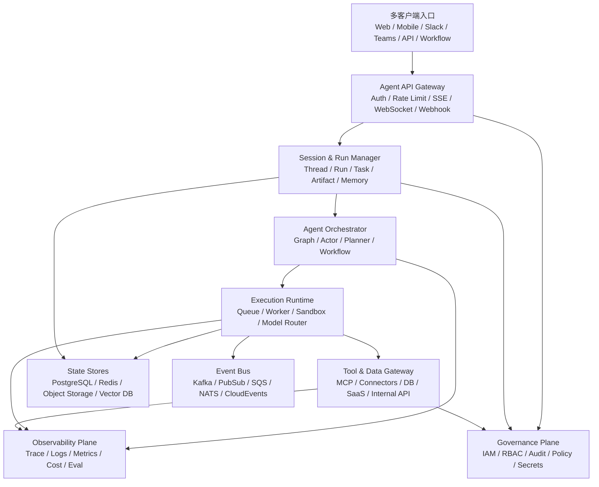

# AgentFlow 与企业级 Cloud Agents 框架/运行时技术调研报告

> 调研时间：2026-06-30  
> 调研对象：云端部署的企业 Agent 框架、托管 Agent 运行时、通信协议、可观测与治理基础设施  
> 核心问题：AgentFlow 作为 Agent 编排系统，应如何吸收企业级 Cloud Agents 的成熟形态？Cloud Agents 是否只是把 Agent 部署到云上？如果不是，企业级 Cloud Agents 的标准形态、成熟方案和建设路径是什么？

## 执行摘要

Cloud Agents 不是“把本地 Agent 搬到云服务器运行”这么简单。它更接近一种面向企业任务的云原生智能应用运行时，至少包含以下能力：

- 多租户、多用户、多客户端入口的会话管理。
- 多实例、多任务、多回合执行的资源调度与状态隔离。
- 长任务的持久化、恢复、重试、补偿和人工介入。
- Agent、工具、数据、身份之间的安全边界与审计链路。
- Trace、日志、指标、成本、质量评估、提示词版本和模型调用的全链路观测。
- 高可用、弹性伸缩、限流、队列化、灾备和发布回滚。
- 与 MCP、A2A、OpenTelemetry、企业 IAM、Secrets、审批流、API 网关等基础设施协同。

本报告的判断是：**Cloud Agents 是企业 Agent 的必然选择，但成熟形态不会由单一 Agent 框架独立完成，而会演化成“Agent 编排框架 + 云端运行时 + 协议网关 + 可观测与治理平面 + 企业数据/工具接入层”的复合架构。**

从当前市场看，成熟度较高的方案可分为四类：

| 类别 | 代表方案 | 成熟度判断 | 适用场景 |
| --- | --- | --- | --- |
| 托管式 Agent 平台 | Microsoft Foundry / Azure AI Foundry Agent Service、Amazon Bedrock AgentCore、Google Gemini Enterprise Agent Platform / Agent Runtime | 企业治理、身份、观测和云资源集成较强 | 强云厂商绑定、重合规、快速上线企业内部 Agent |
| 云原生 Agent 运行时 | LangSmith Deployment / LangGraph、CrewAI Enterprise / AMP | Agent 工程体验强，适合自定义业务流 | 复杂业务编排、多 Agent 流程、希望掌握应用层控制权 |
| Agent SDK / 编排框架 | OpenAI Agents SDK、Microsoft Agent Framework / AutoGen、Google ADK、LlamaIndex、Pydantic AI、Mastra | 适合作为应用层框架，本身不总是完整云端控制平面 | 自研 Cloud Agent 平台或嵌入现有后端系统 |
| 基础设施与治理组件 | Langfuse、Arize Phoenix、OpenTelemetry、Temporal、MCP、A2A、API Gateway、Kubernetes | 不是 Agent 框架，但决定生产可用性 | 自建企业 Agent Runtime、跨框架标准化 |

如果目标是建设企业级 Cloud Agents，而非单个 Demo，本报告建议采用“三层选型”：

1. **业务编排层**：LangGraph、Microsoft Agent Framework / AutoGen、Google ADK、OpenAI Agents SDK、CrewAI 等。
2. **运行时层**：LangSmith Deployment、Bedrock AgentCore、Microsoft Foundry / Azure AI Foundry Agent Service、Gemini Enterprise Agent Platform / Agent Runtime、Temporal + Kubernetes 自研运行时。
3. **治理与观测层**：OpenTelemetry + Langfuse/Phoenix/LangSmith + 云厂商 IAM/Audit/Secrets + MCP/A2A Gateway。

## Cloud Agents 的定义

### 与 Remote-control Agent 的差异

Remote-control Agent 通常强调“让模型控制一个远程环境”，例如浏览器、桌面、IDE、终端、虚拟机或容器。它的关键挑战是视觉/DOM/文件系统/命令行控制、沙箱隔离、回放和权限约束。

Cloud Agents 更强调“让 Agent 成为可被企业系统稳定调用的云端服务”。它并不排斥浏览器控制、代码执行或远程桌面，但这些只是工具能力。Cloud Agents 的核心不是控制一个屏幕，而是把 Agent 变成具备工程边界的后端运行单元。

| 维度 | Remote-control Agent | Cloud Agents |
| --- | --- | --- |
| 主要对象 | 浏览器、桌面、IDE、终端、VM、容器 | 企业任务、业务流程、数据系统、用户会话、工具网络 |
| 交互形态 | 单用户、单环境、强交互、近实时控制较多 | 多用户、多客户端、多任务、异步与同步混合 |
| 状态边界 | 远程环境状态、屏幕状态、文件状态 | 会话状态、任务状态、工作流状态、工具调用状态、审计状态 |
| 主要难点 | 操作可靠性、沙箱、环境复现、视觉/DOM 定位 | 资源管理、通信协议、持久化、观测、审计、安全、可用性 |
| 成熟度指标 | 能否稳定完成远程操作 | 能否作为企业级服务长期稳定运行 |

### Cloud Agents 的最小能力集

企业级 Cloud Agents 至少应具备以下最小能力：

| 能力域 | 必备能力 |
| --- | --- |
| 会话与状态 | 用户会话、线程、任务、运行实例、长期记忆、短期上下文、Artifacts 管理 |
| 通信 | HTTP API、SSE/WebSocket 流式输出、Webhook、事件总线、A2A、MCP 工具网关 |
| 多实例资源管理 | 并发控制、队列、租户隔离、执行超时、取消、恢复、模型/工具配额 |
| 工具与数据接入 | 工具注册、工具权限、Secrets、数据连接器、沙箱执行、审批 |
| 可观测性 | LLM Trace、Tool Trace、日志、指标、成本、Token、延迟、错误归因、评估数据 |
| 治理审计 | IAM、RBAC、ABAC、租户隔离、审计日志、数据保留、PII/敏感数据策略 |
| 高可用 | 多副本、弹性伸缩、重试、幂等、检查点、灾备、发布回滚 |
| 开发运维 | 版本化、灰度发布、Prompt/Agent 配置管理、评估、CI/CD、回放调试 |

## 参考架构

企业 Cloud Agents 更像一个云原生平台，而不是一个 Python 包。推荐的参考架构如下：



这个架构的关键点是：

- **Gateway 不只是反向代理**：它负责身份、租户、限流、连接保持、流式响应、Webhook 回调、客户端断线重连。
- **Session & Run Manager 是 Cloud Agent 的中枢**：用户看到的是对话，但系统内部必须区分 thread、run、step、tool call、artifact、checkpoint。
- **Orchestrator 不应承担所有职责**：复杂流程可由 LangGraph / AutoGen / Microsoft Agent Framework / ADK / CrewAI 负责，但资源调度、审计、发布和租户隔离应在平台层完成。
- **Agent 执行器应协议化**：云端运行时不应假设 worker 一定是某个特定 CLI。Qwen Code `qwen serve` 可以作为第一版成熟执行器，但长期应抽象成 ACP-compatible Agent runtime，让 Claude Code、Codex、OpenCode 或自研 Agent 只要实现同一通信协议就能接入。
- **Tool Gateway 是安全边界**：企业 Agent 真正的风险通常发生在工具调用、数据访问和外部系统写操作。
- **Observability 与 Governance 必须是一等公民**：上线后最常见的问题不是“模型不会回答”，而是“无法解释为什么调用了某个工具、花了多少钱、谁授权了、失败后如何恢复”。

## 成熟方案调研

### 1. LangSmith Deployment / LangGraph

官方资料：

- [LangSmith Deployment](https://docs.langchain.com/langgraph-platform/)
- [LangGraph Platform Deployment Options](https://docs.langchain.com/langgraph-platform/deployment-options)
- [LangGraph Persistence](https://langchain-ai.github.io/langgraph/concepts/persistence/)
- [LangSmith Tracing](https://docs.smith.langchain.com/observability/how_to_guides/tracing/trace_with_langgraph)

LangGraph 是当前最适合构建复杂、可控、可恢复 Agent 流程的开源编排框架之一。其核心抽象是状态图，开发者显式定义节点、边、条件路由、状态更新和检查点。LangSmith Deployment 则把 Agent 运行时平台化，官方文档将其描述为面向 Agent workloads 的 workflow orchestration runtime，支持 durable execution、real-time streaming、horizontal scaling，并通过 Agent Server 暴露 assistants、threads、runs 等执行模型。

**核心能力**

| 维度 | 能力评估 |
| --- | --- |
| 编排模型 | 显式图状态机，适合复杂分支、循环、人机协同和可控业务流 |
| 会话管理 | 以 thread/run 为核心管理多轮会话与执行实例 |
| 持久化 | Checkpointer 支持状态快照、时间旅行、恢复与调试 |
| 云端部署 | 支持 Cloud、Standalone Server、自托管完整平台等形态，围绕 Agent Server 暴露 API |
| 多实例 | 通过平台服务、队列和 worker 承载并发执行 |
| Trace | 与 LangSmith 深度集成，具备 LLM/Tool/Graph 级 trace |
| 企业治理 | 企业版提供团队、项目、权限、部署与观测能力，但底层 IAM/审计仍需结合云环境 |

**优势**

- 对状态、分支、循环、人工中断和恢复的控制力强。
- 适合把 Agent 做成确定性更高的业务工作流，而不是纯聊天机器人。
- LangSmith 的 Trace 与评估生态成熟，调试体验好。
- 对复杂业务非常友好，尤其是需要 checkpoint、回放、人工审批、长上下文状态演进的场景。

**短板**

- 开发者必须理解状态图和持久化模型，学习曲线高于角色式框架。
- Cloud governance 不是全部由 LangGraph 自身解决，仍需接入企业 IAM、审计、Secrets、网络策略。
- 如果业务只是简单 RAG 问答，LangGraph 可能显得重。

**适用判断**

LangSmith Deployment / LangGraph 是自建企业 Cloud Agents 的强候选。如果企业希望保留应用层控制权，同时获得成熟的 Agent 状态管理和观测能力，它比纯云厂商黑盒 Agent 平台更灵活。

### 2. Microsoft Foundry / Azure AI Foundry Agent Service / Microsoft Agent Framework / AutoGen

官方资料：

- [Azure AI Foundry Agent Service](https://learn.microsoft.com/azure/ai-services/agents/overview)
- [Azure AI Foundry Agents Concepts](https://learn.microsoft.com/azure/ai-services/agents/concepts/agents)
- [Microsoft Agent Framework](https://learn.microsoft.com/agent-framework/)
- [AutoGen Documentation](https://microsoft.github.io/autogen/)

微软路线正在从早期 AutoGen 的多 Agent 对话框架，演进到 Microsoft Foundry / Azure AI Foundry Agent Service 与 Microsoft Agent Framework 的企业平台组合。当前官方文档将 Foundry Agent Service 定位为构建、部署、扩展 AI Agents 的托管平台，并提供 Prompt agents、Hosted agents、Responses API、Agent Runtime、工具、模型、观测、身份安全、发布版本等能力；Microsoft Agent Framework 则整合 Semantic Kernel 与 AutoGen 的经验，提供面向企业应用的 Agent 与 Workflow SDK。

**核心能力**

| 维度 | 能力评估 |
| --- | --- |
| 编排模型 | Agent + Workflow；AutoGen 强在多 Agent 对话和事件驱动协作 |
| 会话管理 | Foundry Agent Service 管理 conversations、tool calls、agent lifecycle，并支持 session-level state persistence |
| 云端部署 | Azure 原生托管，支持无代码 Prompt agents 与容器化 Hosted agents |
| 企业治理 | 与 Microsoft Entra、Azure RBAC、Private networking、Application Insights、Monitor、审计生态衔接较好 |
| 多客户端 | 适合作为企业应用后端，通过 API 接入 Teams、Web、业务系统 |
| Trace | 官方提供 end-to-end tracing、metrics、Application Insights 集成 |
| 合规 | Azure 企业客户基础强，适合已有 Microsoft 生态的组织 |

**优势**

- 与 Microsoft 365、Teams、Azure 数据和身份生态天然贴近。
- 对企业身份、安全、网络隔离、合规的支撑强。
- AutoGen 社区和研究生态仍有影响力，适合多 Agent 协作实验。
- Foundry Agent Service 的托管形态降低了自建运行时成本。

**短板**

- 平台绑定 Azure，跨云和自托管自由度低于 LangGraph + 自建运行时。
- Microsoft Agent Framework 与 Foundry Agent Service 的边界仍在演进，产品线名词较多，架构选型需要谨慎。
- AutoGen 适合多 Agent 研究和协作，但生产系统仍需补齐持久化、治理、发布、审计等平台能力。

**适用判断**

如果企业已经深度使用 Azure、Microsoft 365、Entra ID、Teams，Microsoft Foundry / Azure AI Foundry Agent Service 是当前最现实的 Cloud Agents 路线之一。它更像企业托管 Agent 平台，而不是单纯开发框架。

### 3. Amazon Bedrock AgentCore / Amazon Bedrock Agents

官方资料：

- [Amazon Bedrock AgentCore](https://docs.aws.amazon.com/bedrock-agentcore/latest/devguide/what-is-bedrock-agentcore.html)
- [AgentCore Runtime](https://docs.aws.amazon.com/bedrock-agentcore/latest/devguide/runtime.html)
- [AgentCore Memory](https://docs.aws.amazon.com/bedrock-agentcore/latest/devguide/memory.html)
- [AgentCore Gateway](https://docs.aws.amazon.com/bedrock-agentcore/latest/devguide/gateway.html)
- [Amazon Bedrock Agents](https://docs.aws.amazon.com/bedrock/latest/userguide/agents.html)

AWS 的路线非常明确：Bedrock Agents 面向托管式 Agent 构建，而 Bedrock AgentCore 更像企业级 Agent 运行时组件集，包含 Runtime、Harness、Memory、Gateway、Identity、Code Interpreter、Browser、Observability、Evaluations、Optimization、Policy、Registry、Payments 等能力。AgentCore 的出现说明云厂商已经把 Agent 从“模型应用”提升为“云运行时工作负载”。

**核心能力**

| 维度 | 能力评估 |
| --- | --- |
| 编排模型 | Bedrock Agents 提供托管 Agent；AgentCore 更偏运行时组件 |
| Runtime | 支持部署和运行 Agent 工作负载，强调 session isolation、serverless scaling、异步 Agent 支撑 |
| Harness | 托管 Agent loop，可把模型、系统提示和工具组合成单 API 调用，并支持隔离 microVM 与自定义容器 |
| Memory | 提供短期/长期记忆能力，便于跨会话个性化和上下文延续 |
| Gateway | 面向工具、API、Lambda、MCP 等接入的统一入口 |
| Identity | 将 Agent 与企业身份、权限、资源访问绑定 |
| Observability | 接入 AWS 观测体系，支持 OTel 兼容 telemetry、CloudWatch、Trace 调试 |
| Governance | Policy 和 Registry 能把工具、Agent、MCP Server、技能纳入审批、发现和策略管控 |
| 沙箱工具 | Code Interpreter、Browser 等能力更接近 Cloud Agent 工具运行环境 |

**优势**

- 更接近企业 Cloud Agents 所需的基础设施组件化形态。
- 与 AWS IAM、CloudWatch、VPC、Lambda、S3、Step Functions、SQS 等基础设施整合空间大。
- Runtime、Memory、Gateway、Identity 的产品拆分符合企业架构分层。
- Policy、Registry、Evaluations、Optimization 说明 AWS 正在把治理、质量和持续优化纳入 Agent 平台，而不是只提供运行容器。
- 对多工具、多数据源、云资源自动化场景友好。

**短板**

- AWS 绑定较强，跨云或本地部署成本高。
- AgentCore 是较新的产品形态，长期 API 稳定性和生态成熟度需要持续观察。
- 如果企业需要强自定义的复杂图流程，仍可能需要 LangGraph、Temporal 或自研 orchestrator。

**适用判断**

Bedrock AgentCore 是当前最值得关注的 Cloud Agent 基础设施之一。它的价值不在于“又一个 Agent DSL”，而在于把运行、记忆、工具网关、身份、观测拆成云服务组件，贴近企业生产需求。

### 4. Google Gemini Enterprise Agent Platform / Agent Runtime / ADK

官方资料：

- [Google Agent Development Kit](https://google.github.io/adk-docs/)
- [Vertex AI Agent Engine](https://cloud.google.com/vertex-ai/generative-ai/docs/agent-engine/overview)
- [Deploy ADK agents to Agent Engine](https://cloud.google.com/vertex-ai/generative-ai/docs/agent-engine/deploy-adk)
- [Gemini Enterprise Agent Platform](https://cloud.google.com/products/gemini-enterprise)

Google 的 Agent 技术栈由 ADK、Gemini Enterprise Agent Platform / Agent Runtime、Agent Gateway、Sessions、Memory Bank、Sandbox、Agent Registry、Evaluation、Observability 等组成。早期 Vertex AI Agent Engine 的文档入口已被重定向到 Gemini Enterprise Agent Platform 的 Scale 体系，说明 Google 也在把 Agent 从单点托管服务升级为平台化运行时。

**核心能力**

| 维度 | 能力评估 |
| --- | --- |
| 编排模型 | ADK 支持 Agent、工具、会话、Artifacts、评估等开发能力 |
| 云端部署 | Agent Runtime 提供托管运行、流量、修订、访问控制、日志、监控、tracing |
| 会话与状态 | 平台提供 Sessions、Memory Bank，ADK 设计中也包含 Session、Memory、Artifact 等概念 |
| 企业数据 | 与 Google Cloud、BigQuery、Workspace、Vertex AI Search 等生态结合 |
| 评估 | 平台包含 Agent evaluation、online monitors、prompt optimization、example store 等能力 |
| 治理 | 借助 Google Cloud IAM、Agent Identity、Agent Gateway、Policy、Model Armor、Private Service Connect 等能力 |

**优势**

- ADK + Agent Runtime 的开发到部署路径比较清晰。
- Google Cloud 数据、搜索和 AI 基础设施能力强。
- 适合已有 BigQuery、Vertex AI、Workspace、Gemini Enterprise 生态的组织。
- 对评估、Artifacts、Sessions、Memory Bank、Sandbox、Gateway、Registry 等概念的建模较完整。

**短板**

- 平台绑定 Google Cloud。
- Gemini Enterprise 与 Vertex AI Agent Engine、ADK 的产品边界需要结合具体场景理解。
- 与 Azure/AWS 一样，复杂业务流程仍可能需要外部工作流引擎或自定义控制平面。

**适用判断**

Google 路线适合希望将 Agent 深度嵌入企业知识搜索、数据分析、Workspace 和 Google Cloud 应用的组织。它不是最中立的方案，但对 Google 生态用户有明显工程优势。

### 5. OpenAI Agents SDK / Responses API / Assistants-like Thread Model

官方资料：

- [OpenAI Agents SDK](https://openai.github.io/openai-agents-python/)
- [OpenAI Agents SDK Tracing](https://openai.github.io/openai-agents-python/tracing/)
- [OpenAI Platform Docs](https://platform.openai.com/docs)

OpenAI Agents SDK 提供 Agent、工具、handoff、guardrails、tracing 等应用层能力。它适合构建轻量到中等复杂度的 Agent 应用，并与 OpenAI 模型和工具生态结合紧密。OpenAI 的平台 API 中也长期存在 thread/run/message 等云端会话模型思想，适合构建多轮、多工具的服务端应用。

**核心能力**

| 维度 | 能力评估 |
| --- | --- |
| 编排模型 | Agent、tool、handoff、guardrail、human-in-the-loop，偏 SDK 层 |
| Trace | SDK 内置 tracing 概念，便于调试 Agent 调用链 |
| 工具生态 | 与 OpenAI 模型、内置工具和函数调用能力结合紧密 |
| 会话 | SDK 提供 Sessions，并支持 SQLAlchemy、SQLite、Redis、MongoDB、Dapr、EncryptedSession 等扩展形态 |
| 沙箱 | Sandbox agents 支持隔离 workspace、manifest 权限、resumable sandbox sessions |
| 云端运行时 | 更偏开发 SDK 和模型平台，不等同于完整企业 Agent PaaS |
| 企业治理 | 需要结合自建后端、云 IAM、日志审计和第三方 observability |

**优势**

- 轻量、直接，适合快速构建服务端 Agent。
- 与 OpenAI 最新模型和工具能力结合最紧。
- handoff 和 guardrails 抽象适合常见多 Agent/安全边界设计。
- 2026 年版本已明显增强 session、sandbox、MCP、human-in-the-loop 和 tracing，作为 Cloud Agent 应用内核更完整。

**短板**

- 如果要做企业级 Cloud Agents，需要自建 session/run manager、队列、持久化、审计和高可用运行时。
- 对跨模型、跨云、中立框架的诉求不如 LangGraph 或自研架构灵活。

**适用判断**

OpenAI Agents SDK 适合作为 Cloud Agent 的业务层 SDK，而不是单独承担完整企业 Agent 平台。它更像“Agent 应用开发内核”，企业需要在外侧补齐运行时和治理平面。

### 6. CrewAI Enterprise / AMP

官方资料：

- [CrewAI Documentation](https://docs.crewai.com/)
- [CrewAI Enterprise](https://www.crewai.com/enterprise)
- [CrewAI AMP](https://docs.crewai.com/en/enterprise/amp)

CrewAI 的优势在于角色式 Agent 与任务协作抽象，开发体验接近“定义一个团队完成任务”。CrewAI Enterprise / AMP 则尝试把 Crew、Flow、部署、追踪、管理等能力平台化。

**核心能力**

| 维度 | 能力评估 |
| --- | --- |
| 编排模型 | Role + Goal + Task + Crew；也支持 Flow 等更结构化流程 |
| 开发体验 | 上手快，适合原型和角色分工明确的任务 |
| 云端平台 | Enterprise / AMP 提供部署、管理、观测与企业能力 |
| 多 Agent | 多角色协作是核心卖点 |
| Trace | CrewAI 平台与外部 observability 集成逐步完善 |

**优势**

- 低门槛，业务人员和应用开发者容易理解。
- 适合内容生成、调研、运营、销售支持、报告生成等角色分工明确的流程。
- Enterprise/AMP 说明其正从开源框架走向云端 Agent 平台。

**短板**

- 对复杂状态机、强确定性控制、严格事务边界的表达力弱于 LangGraph。
- 企业级治理、审计、复杂资源调度能力仍需要结合平台版本或外部基础设施验证。
- 容易在 Demo 阶段显得强，在复杂生产流程中需要大量工程补强。

**适用判断**

CrewAI 适合快速产品化角色协作型 Agent，但如果企业任务涉及复杂分支、长周期恢复、严格审批和强审计，需要谨慎评估平台层能力。

### 7. Dify

官方资料：

- [Dify Documentation](https://docs.dify.ai/)
- [Dify GitHub](https://github.com/langgenius/dify)
- [Dify Self-hosted Deployment](https://docs.dify.ai/getting-started/install-self-hosted)

Dify 是面向企业和团队的低代码 LLM 应用平台，覆盖 Chatbot、Agent、Workflow、RAG、数据集、Prompt、工具、API 发布、日志等能力。它不是底层 Agent 编排框架，而是“Agent/LLM App 平台”。

**核心能力**

| 维度 | 能力评估 |
| --- | --- |
| 应用形态 | Chatbot、Agent、Workflow、RAG、API 发布 |
| 部署 | 支持云服务和自托管，适合企业私有化 |
| 多客户端 | 通过 Web App、API、嵌入式入口接入 |
| 运维 | 有日志、应用管理、数据集管理等平台能力 |
| 治理 | 企业版能力需结合版本验证，开源版更偏应用搭建 |

**优势**

- 非常适合构建企业内部 LLM 应用和工作流。
- 自托管友好，降低从 Demo 到内部工具的门槛。
- 对 RAG、数据集、Prompt、工作流、应用发布的产品化体验完整。

**短板**

- 底层复杂 Agent 状态控制和长周期任务恢复能力不如专门的 Agent runtime。
- 高并发、多租户、审计、HA 等生产要求需要企业版和自建部署能力共同验证。
- 更适合 LLM App 平台，而不是所有 Cloud Agent runtime 的底座。

**适用判断**

Dify 很适合作为企业低代码 Agent 应用门户和内部 AI 应用平台。如果目标是高度定制的多 Agent 云运行时，Dify 更适合作为上层应用平台或快速交付工具，而不是唯一底座。

### 8. Letta

官方资料：

- [Letta Documentation](https://docs.letta.com/)
- [Letta Stateful Agents](https://docs.letta.com/guides/core-concepts/stateful-agents/)
- [Letta Server](https://docs.letta.com/guides/server/overview)

Letta 的核心价值是 stateful agents，即把 Agent 的记忆、状态、工具和长期人格/任务上下文作为服务端对象管理。它对 Cloud Agents 的启发很重要：企业 Agent 不应只是 stateless function calling，而应具备可查询、可调试、可迁移的状态边界。

**核心能力**

| 维度 | 能力评估 |
| --- | --- |
| 状态模型 | 强调持久化 Agent state 与 memory |
| 服务端形态 | Letta Server 提供 API 管理 Agent |
| 记忆 | 长期记忆和上下文管理是核心卖点 |
| 应用场景 | 长期助理、个性化 Agent、持续任务 |

**优势**

- 对“Agent 作为持久对象”的建模清晰。
- 适合长期记忆、个性化和跨会话延续场景。
- 可作为自研 Cloud Agent 的状态管理参考。

**短板**

- 与 LangGraph、云厂商平台相比，企业运行时生态和治理能力需要进一步评估。
- 不适合单独承担复杂工作流编排和企业级多租户平台。

**适用判断**

Letta 值得作为“状态化 Agent 服务”的技术参考，尤其是长期记忆和 Agent 对象生命周期管理。但作为完整企业 Cloud Agents 平台还需要结合其他运行时组件。

### 9. Temporal / Durable Execution 基础设施

官方资料：

- [Temporal Documentation](https://docs.temporal.io/)
- [Temporal Durable Execution](https://docs.temporal.io/temporal)
- [Temporal AI Agent examples](https://github.com/temporalio/samples-python/tree/main/ai_agent)

Temporal 不是 Agent 框架，但对 Cloud Agents 非常关键。企业 Agent 的大量问题本质上是长周期、分布式、不可靠外部调用下的 durable execution 问题：LLM 调用可能失败，工具可能超时，用户审批可能等待数天，容器可能重启，第三方 API 可能重复回调。Temporal 的 workflow、activity、retry、signal、query、timer、版本化等机制可为 Agent 提供可靠执行底座。

**适用判断**

当 Agent 任务涉及金融审批、供应链、工单、代码变更、数据处理、IT 自动化等长周期流程时，Temporal + Agent 编排框架是比单独 Agent SDK 更稳的路线。

## 协议与标准

### MCP：工具与上下文接入协议

官方资料：

- [Model Context Protocol](https://modelcontextprotocol.io/)
- [MCP Specification](https://modelcontextprotocol.io/specification)

MCP 解决的是“模型/Agent 如何标准化连接工具和上下文”的问题。它把工具、资源、提示词、采样、传输、授权等进行协议化，正在成为 Agent 工具接入层的重要标准。

在 Cloud Agents 中，MCP 不宜被简单理解为“本地工具插件协议”。企业更需要的是 **MCP Gateway**：

- 统一管理 MCP Server 注册、版本和健康状态。
- 给不同 Agent、租户、用户分配不同工具权限。
- 记录每次工具调用的输入、输出、身份、审批和审计。
- 将本地 stdio 工具迁移到远程 Streamable HTTP / SSE 等云端传输形态。
- 为高风险工具增加策略拦截、人工审批、脱敏和回滚。

### A2A：Agent-to-Agent 通信协议

官方资料：

- [Agent2Agent Protocol](https://a2a-protocol.org/latest/)
- [A2A GitHub](https://github.com/a2aproject/A2A)

A2A 面向 Agent 之间的互操作，关注任务、消息、Artifacts、流式状态更新、能力发现等。它适合解决跨团队、跨平台、跨供应商 Agent 协作的问题。

在 Cloud Agents 中，A2A 的价值主要体现在：

- 一个企业内部可能有多个 Agent 平台，不同 Agent 需要互相委托任务。
- SaaS 厂商可能暴露自己的 Agent 服务，企业 Agent 需要调用外部 Agent。
- 多 Agent 不一定在同一进程、同一框架或同一云厂商内。
- A2A 可以成为 Agent Gateway 的 north-south 或 east-west 通信标准之一。

### OpenTelemetry：Agent 可观测的底座

官方资料：

- [OpenTelemetry Semantic Conventions for GenAI](https://opentelemetry.io/docs/specs/semconv/gen-ai/)
- [OpenTelemetry](https://opentelemetry.io/)

Cloud Agents 的 trace 不能只停留在“LLM 请求日志”。生产环境至少需要串联：

- 用户请求和客户端连接。
- Agent thread、run、step。
- LLM 调用、模型名、Token、延迟、错误、成本。
- Tool call、外部 API、数据库查询、文件读写、代码执行。
- MCP/A2A 调用链。
- 人工审批、策略拦截、重试、取消和恢复。

OpenTelemetry 的价值在于提供跨语言、跨服务、跨供应商的统一采集语义。LangSmith、Langfuse、Phoenix、云厂商 tracing 都可以作为上层呈现和分析工具，但底层最好保留 OTel 兼容性。

## 能力矩阵

### 总体成熟度对比

评分说明：5 为非常成熟或原生支持，3 为可用但需要补强，1 为主要依赖自研或不适合。

| 方案 | 云端运行时 | 会话/状态 | 多实例资源管理 | 多客户端连接 | Trace/观测 | 审计治理 | 高可用 | 框架中立性 | 综合判断 |
| --- | ---: | ---: | ---: | ---: | ---: | ---: | ---: | ---: | --- |
| LangSmith Deployment / LangGraph | 5 | 5 | 4 | 4 | 5 | 3 | 4 | 4 | 自建复杂 Cloud Agent 的强候选 |
| Microsoft Foundry / Azure AI Foundry Agent Service | 5 | 5 | 4 | 4 | 4 | 5 | 5 | 2 | Microsoft 生态企业优先 |
| Bedrock AgentCore | 5 | 4 | 5 | 4 | 4 | 5 | 5 | 3 | AWS 生态企业优先，运行时组件化突出 |
| Gemini Enterprise Agent Platform / ADK | 5 | 5 | 4 | 4 | 4 | 5 | 5 | 3 | Google Cloud 数据与 Workspace 生态优先 |
| OpenAI Agents SDK | 3 | 4 | 2 | 3 | 4 | 2 | 2 | 3 | 应用层 SDK，需外接平台能力 |
| CrewAI Enterprise / AMP | 4 | 3 | 3 | 3 | 3 | 3 | 3 | 3 | 角色协作型 Agent 产品化快 |
| Dify | 4 | 3 | 3 | 4 | 3 | 3 | 3 | 3 | 低代码 LLM 应用平台 |
| Letta | 3 | 5 | 2 | 3 | 2 | 2 | 2 | 3 | 状态化 Agent 与长期记忆参考 |
| Temporal + 自研 Runtime | 4 | 5 | 5 | 3 | 4 | 4 | 5 | 5 | 长周期关键任务的可靠底座 |

### Cloud Agents 分层选型

| 层级 | 要解决的问题 | 可选方案 |
| --- | --- | --- |
| Agent 开发层 | Prompt、工具、handoff、多 Agent、工作流 | LangGraph、OpenAI Agents SDK、Google ADK、Microsoft Agent Framework、CrewAI、LlamaIndex、Pydantic AI |
| 会话运行层 | thread/run/task、状态、队列、worker、checkpoint | LangSmith Deployment、Microsoft Foundry Agent Service、AgentCore Runtime、Google Agent Runtime、Temporal、自研 |
| 通信层 | 多客户端、流式响应、Agent 间通信、工具协议 | HTTP/SSE/WebSocket、Webhook、MCP、A2A、CloudEvents、Kafka/NATS/SQS |
| 状态存储层 | 记忆、Artifacts、向量、工作流状态 | PostgreSQL、Redis、S3/GCS/Blob、Vector DB、Checkpointer、Letta |
| 工具接入层 | 企业 API、SaaS、数据库、代码执行、浏览器 | MCP Gateway、API Gateway、Lambda/Functions、Sandbox、Browser Runtime |
| 观测层 | Trace、日志、指标、成本、质量 | LangSmith、Langfuse、Phoenix、OpenTelemetry、CloudWatch、Azure Monitor、Cloud Logging |
| 治理层 | 身份、权限、审计、策略、Secrets | IAM/Entra/Google IAM、Vault/Secrets Manager、OPA、Audit Logs、DLP |

## 企业落地关键设计

### 1. 会话模型设计

Cloud Agents 的会话模型不应只保存 chat messages。建议至少建模：

| 对象 | 含义 |
| --- | --- |
| Tenant | 企业、部门或业务域 |
| User | 真实用户或服务账号 |
| Client | Web、Mobile、Teams、Slack、API、Webhook 等入口 |
| Conversation / Thread | 用户可感知的多轮上下文 |
| Run | 一次 Agent 执行实例，可同步或异步 |
| Step | Agent 内部一步推理、工具调用、审批或子任务 |
| ToolCall | 工具调用记录，必须可审计 |
| Artifact | 文件、报告、表格、代码、图像等产物 |
| Checkpoint | 可恢复的执行状态 |
| Memory | 长期偏好、业务事实、可复用上下文 |

推荐设计原则：

- Thread 与 Run 分离：同一对话中可有多次运行，运行可取消、重试、恢复。
- Step 具备幂等键：避免客户端重连、Webhook 重试导致重复执行。
- Artifact 不嵌入消息正文：统一存对象存储，并记录元数据、权限和版本。
- Memory 与 Conversation 分离：对话历史不等于长期记忆，长期记忆必须可审计、可删除、可迁移。

### 2. 多客户端连接

企业 Cloud Agents 通常同时服务多个入口：

- Web Console。
- Slack / Teams / 飞书。
- 移动端。
- 后端 API。
- 定时任务。
- 事件触发器。
- 外部 Agent 调用。

推荐模式：

- 短任务使用 HTTP request/response。
- 长任务使用异步 Run + 轮询或 Webhook。
- 实时输出使用 SSE；需要双向交互时使用 WebSocket。
- 企业系统集成使用 Webhook + 幂等键 + 签名校验。
- Agent-to-Agent 使用 A2A 或内部任务协议。
- 工具调用使用 MCP Gateway 或受控 API Gateway。

关键工程点：

- 客户端断线后可根据 run_id 恢复订阅。
- 同一 run 只允许一个执行 owner，多个客户端只是观察者或审批者。
- 人工审批应作为 step 状态持久化，而不是阻塞 worker 线程。
- 流式输出和最终结果需要统一事件模型，避免 UI 与后端状态不一致。

### 3. 多实例与资源管理

Cloud Agents 的资源管理不能只依赖容器自动扩缩容。Agent 执行有自己的资源语义：

| 资源 | 管理策略 |
| --- | --- |
| LLM 调用配额 | 按租户、用户、Agent、模型限流 |
| Tool 并发 | 高风险工具串行化，读工具可并发，写工具需幂等 |
| Worker 池 | 按任务类型拆分：chat、workflow、code、browser、batch |
| 长任务 | 队列化 + checkpoint + heartbeat |
| 沙箱 | 每个 run 或 step 独立容器/微虚拟机，按风险分级 |
| 记忆与向量检索 | 按租户隔离索引，控制召回范围 |
| 成本 | 预算、熔断、模型降级、缓存 |

推荐引入三类队列：

- **interactive queue**：面向用户实时对话，低延迟、高优先级。
- **workflow queue**：面向长流程和业务自动化，可恢复、可重试。
- **batch queue**：面向批处理、调研、数据生成，低优先级、可抢占。

### 4. Trace 与可观测性

Agent trace 的粒度建议至少覆盖：

```text
request
  -> auth_context
  -> conversation/thread
  -> run
  -> planner_step
  -> model_call
  -> tool_call
  -> external_api/db
  -> artifact_write
  -> policy_check
  -> human_approval
  -> final_response
```

关键指标：

- P50/P95/P99 延迟。
- 每个 run 的模型调用次数、Token、成本。
- Tool 调用成功率、超时率、重试次数。
- Agent loop 次数、最大深度、停止原因。
- 人工审批等待时间。
- 检索命中率、引用覆盖率。
- 用户反馈、自动评估分、回归测试结果。
- 每个版本的失败率和成本变化。

推荐工具组合：

- 使用 OpenTelemetry 作为底层 trace 语义。
- 使用 LangSmith / Langfuse / Phoenix 作为 Agent Trace 和评估 UI。
- 云原生日志与指标进入 CloudWatch / Azure Monitor / Cloud Logging。
- 所有 ToolCall 与高风险操作写入不可篡改审计日志。

### 5. 审计与治理

企业 Agent 的审计不能只记录“用户问了什么，模型答了什么”。必须覆盖：

- 谁发起了任务。
- 使用了哪个 Agent 版本和 Prompt 版本。
- 调用了哪个模型。
- 检索了哪些数据源和文档。
- 调用了哪些工具。
- 以谁的身份调用工具。
- 是否经过策略检查或人工审批。
- 输出了哪些 Artifact。
- 是否写入了外部系统。
- 失败、重试、取消、恢复的完整过程。

治理建议：

- 使用真实用户身份传播到工具层，避免所有工具以单一系统账号执行。
- 对写操作工具实施审批、Dry-run、回滚或补偿动作。
- Secrets 不进入 Prompt，不进入 Trace 明文。
- 高风险工具执行前做 Policy Check，执行后做审计落库。
- 对长期记忆提供查看、修改、删除和保留期策略。
- 对模型输入输出做敏感信息检测和数据保留策略。

### 6. 稳定性与可用性

Cloud Agents 的高可用不只是多副本部署。Agent 的失败形态更复杂：

| 失败类型 | 应对策略 |
| --- | --- |
| LLM 超时或限流 | 指数退避、模型降级、队列重试、预算熔断 |
| 工具调用失败 | 幂等重试、补偿动作、人工介入 |
| Agent 死循环 | 最大步数、最大成本、最大时间、循环检测 |
| 容器重启 | checkpoint + durable queue + run resume |
| 客户端断线 | run 状态持久化 + SSE/WebSocket 恢复订阅 |
| 外部 API 重复回调 | 幂等键 + 去重表 |
| 模型输出不稳定 | 结构化输出校验、guardrail、回放测试 |
| 发布回归 | Agent 版本化、灰度、自动评估、快速回滚 |

建议 SLO：

- 交互式 Agent 首 Token 延迟：P95 < 3-5 秒，视模型和工具而定。
- 非工具调用普通问答完成：P95 < 15 秒。
- 工具型 run 状态可查询性：99.9%。
- Run 恢复成功率：> 99%。
- 审计日志写入成功率：> 99.99%。
- 高风险写操作无审计通过率：0。

## 推荐落地架构

### 路线 A：云厂商托管优先

适合：

- 企业已经重度使用 Azure/AWS/GCP。
- 安全合规要求高，希望使用云厂商 IAM、审计、网络隔离。
- 第一阶段目标是快速上线内部 Agent。

推荐组合：

| 云 | 推荐栈 |
| --- | --- |
| Azure | Microsoft Foundry / Azure AI Foundry Agent Service + Microsoft Agent Framework + Entra ID + Azure Monitor + AI Search |
| AWS | Bedrock AgentCore + Bedrock Agents + IAM + CloudWatch + Lambda/Step Functions/SQS |
| GCP | ADK + Gemini Enterprise Agent Platform / Agent Runtime + Cloud IAM + Cloud Logging/Trace |

风险：

- 平台绑定强。
- 复杂业务流可能需要额外 workflow/orchestrator。
- 跨云 Agent 协作和统一观测需要自己设计。

### 路线 B：LangGraph 平台化自建

适合：

- 需要复杂状态控制、人工审批、长周期任务和可恢复执行。
- 希望保留模型、云、工具和观测选择权。
- 工程团队有能力运营 Agent 平台。

推荐组合：

```text
LangGraph / LangSmith Deployment
+ PostgreSQL / Redis / Object Storage
+ MCP Gateway
+ OpenTelemetry
+ LangSmith or Langfuse/Phoenix
+ Kubernetes
+ 企业 IAM / Secrets / Audit
```

风险：

- 自建平台运维成本更高。
- 需要明确多租户、权限、审计和发布策略。
- 团队需要理解状态图、checkpoint、并发与恢复。

### 路线 C：Temporal + Agent SDK 自研运行时

适合：

- Agent 任务是关键业务流程的一部分。
- 强依赖长周期执行、审批、补偿、幂等和事务一致性。
- 企业已有成熟微服务和平台工程能力。

推荐组合：

```text
Temporal
+ OpenAI Agents SDK / Google ADK / Microsoft Agent Framework / LangGraph
+ 自研 Session & Run Manager
+ 自研 Tool Gateway / MCP Gateway
+ OpenTelemetry + Langfuse/Phoenix
+ Kubernetes + Queue + Object Storage
```

风险：

- 建设周期最长。
- 需要平台团队和应用团队协作。
- 初期不如托管平台快。

### 路线 D：Dify / CrewAI 快速产品化

适合：

- 目标是快速交付内部 AI 应用、RAG、调研、报告、运营助手。
- 业务流程相对清晰，不需要极复杂的恢复和审计。
- 团队希望低代码或角色式开发。

推荐组合：

```text
Dify or CrewAI Enterprise
+ 企业 SSO / Gateway
+ 外部 Trace / Audit
+ 私有化部署或企业云版本
```

风险：

- 遇到复杂状态机和长周期关键任务时可能需要迁移或深度定制。
- 平台能力需按企业版实际功能验证。

## 建设路线图

### 阶段 1：Cloud Agent MVP

目标：跑通企业可用的最小闭环。

关键任务：

- 定义 Agent API：create_run、get_run、cancel_run、stream_run、approve_step。
- 建立 thread/run/step/tool_call/artifact 数据模型。
- 接入一个 Agent 框架，例如 LangGraph 或 OpenAI Agents SDK。
- 接入一个观测系统，例如 LangSmith、Langfuse 或 Phoenix。
- 所有工具调用写入审计表。
- 支持 SSE 流式响应和客户端断线后恢复查询。

验收标准：

- 能支撑多用户并发。
- 能取消和查询长任务。
- 能追踪一次完整 Agent 执行链路。
- 能回答“谁在什么时候让 Agent 调用了什么工具”。

### 阶段 2：生产运行时

目标：让 Cloud Agent 能稳定跑业务流程。

关键任务：

- 引入队列和 worker 池。
- 增加 checkpoint 与 run resume。
- 增加租户级、用户级、模型级限流。
- 增加高风险工具审批。
- 引入 Prompt/Agent 版本管理。
- 建立自动评估和回归测试集。
- 接入企业 IAM、Secrets、审计日志。

验收标准：

- Worker 重启后任务可恢复。
- 发布新 Agent 版本可灰度和回滚。
- 模型或工具异常时有降级和告警。
- 审计链路覆盖所有写操作。

### 阶段 3：企业 Agent 平台

目标：从单个 Agent 应用升级为企业 Agent 平台。

关键任务：

- 建立 Agent Registry 和 Tool Registry。
- 建立 MCP Gateway 与 A2A Gateway。
- 支持多客户端入口统一接入。
- 支持多租户资源配额和成本中心。
- 支持跨 Agent 委托、协作和任务编排。
- 支持统一评估、质量看板、成本看板。
- 支持数据保留、长期记忆治理和合规报表。

验收标准：

- 新 Agent 可以按模板快速上线。
- 工具权限可按租户、用户、Agent 精细分配。
- 多个 Agent 可以通过标准协议协作。
- 平台能解释质量、成本、风险和失败原因。

## 选型建议

### 如果你要做企业级 Cloud Agents 平台

优先考虑：

1. LangSmith Deployment / LangGraph + 自建运行时。
2. Temporal + LangGraph / OpenAI Agents SDK / ADK。
3. OpenTelemetry + Langfuse/Phoenix/LangSmith。
4. MCP Gateway + 企业 IAM + 审计。

理由：这一路线最中立，控制力强，适合沉淀企业内部 Agent 基础设施。

### 如果企业已经押注某个云

优先考虑：

- Azure / Microsoft 生态：Microsoft Foundry / Azure AI Foundry Agent Service。
- AWS 生态：Bedrock AgentCore。
- Google 生态：Gemini Enterprise Agent Platform / Agent Runtime + ADK。

理由：身份、网络、审计、日志、Secrets 和数据系统一体化会显著降低生产上线成本。

### 如果目标是快速交付内部应用

优先考虑：

- Dify：RAG、工作流、内部 AI 应用平台。
- CrewAI Enterprise：角色协作型任务。
- OpenAI Agents SDK：轻量服务端 Agent。

理由：开发速度快，适合探索业务价值。但应避免一开始就把它们当成完整企业运行时。

### 不建议的做法

- 只用一个 Agent SDK 直接暴露公网 API，不做 run/session 持久化。
- 把所有工具调用放在 Prompt 中隐式控制，不做权限和审计。
- 所有用户共享同一长期记忆或向量索引。
- 把 Trace 当成日志，而不是调试、评估、审计和成本治理的共同底座。
- 用单个 WebSocket 连接承载长任务执行状态，不做服务端恢复。
- 在没有幂等和补偿的情况下允许 Agent 执行写操作。

## 结论

Cloud Agents 的成熟形态不是一个“更聪明的聊天机器人”，而是一种新的云端业务执行层。它把模型推理、工具调用、状态管理、企业身份、通信协议、审计、观测和高可用运行时组合在一起。

从技术趋势看，行业正在形成几个明确方向：

- **Agent 平台化**：Azure、AWS、Google 都在把 Agent 变成托管云服务。
- **运行时组件化**：Runtime、Memory、Gateway、Identity、Observability 正在成为独立能力。
- **协议标准化**：MCP 解决工具接入，A2A 解决 Agent 间互操作，OpenTelemetry 解决可观测语义。
- **状态与持久化成为核心**：thread、run、step、checkpoint、artifact、memory 是 Cloud Agent 的基本工程对象。
- **治理前移**：身份、权限、审计、审批、数据保留不能上线后再补。

最终判断：**Cloud Agents 确实是企业 Agent 的必然选择，但企业真正需要的不是单一框架，而是 Cloud Agent Runtime。框架负责让 Agent 会思考和协作，Runtime 负责让 Agent 可连接、可管理、可追踪、可审计、可恢复、可扩展。**

## 参考资料

- [LangSmith Deployment / LangGraph Platform docs](https://docs.langchain.com/langgraph-platform/)
- [LangGraph Persistence](https://langchain-ai.github.io/langgraph/concepts/persistence/)
- [LangSmith Tracing](https://docs.smith.langchain.com/observability/how_to_guides/tracing/trace_with_langgraph)
- [Microsoft Foundry / Azure AI Foundry Agent Service](https://learn.microsoft.com/azure/ai-services/agents/overview)
- [Microsoft Agent Framework](https://learn.microsoft.com/agent-framework/)
- [AutoGen Documentation](https://microsoft.github.io/autogen/)
- [Amazon Bedrock AgentCore](https://docs.aws.amazon.com/bedrock-agentcore/latest/devguide/what-is-bedrock-agentcore.html)
- [Amazon Bedrock Agents](https://docs.aws.amazon.com/bedrock/latest/userguide/agents.html)
- [Google Agent Development Kit](https://google.github.io/adk-docs/)
- [Google Agent Engine / Gemini Enterprise Agent Runtime docs](https://cloud.google.com/vertex-ai/generative-ai/docs/agent-engine/overview)
- [Gemini Enterprise](https://cloud.google.com/products/gemini-enterprise)
- [OpenAI Agents SDK](https://openai.github.io/openai-agents-python/)
- [CrewAI Documentation](https://docs.crewai.com/)
- [CrewAI Enterprise](https://www.crewai.com/enterprise)
- [Dify Documentation](https://docs.dify.ai/)
- [Letta Documentation](https://docs.letta.com/)
- [Temporal Documentation](https://docs.temporal.io/)
- [Model Context Protocol](https://modelcontextprotocol.io/)
- [Agent2Agent Protocol](https://a2a-protocol.org/latest/)
- [OpenTelemetry GenAI Semantic Conventions](https://opentelemetry.io/docs/specs/semconv/gen-ai/)
