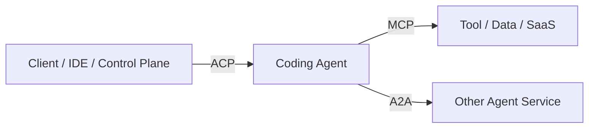

# ACP、A2A 与 MCP 协议选型

> 结论：内部执行器控制应采用 ACP-first 设计，尤其是面向 coding agent 的 session、prompt、streaming、permission、filesystem 和 terminal 能力。A2A 不应替代 ACP，它更适合系统边界上的 Agent-to-Agent 互操作。MCP 是 Agent-to-Tool 的工具接入协议。  
> 因此，本项目的开源兼容目标应是：任意 Agent 只要实现 ACP stdio 或 ACP Streamable HTTP / WebSocket transport，就可以被包装成 SAEU；A2A Gateway 只负责外部 Agent 互操作。

## 三类协议的边界

| 协议 | 核心关系 | 主要对象 | 典型用途 |
| --- | --- | --- | --- |
| ACP | Client-to-Agent | 编辑器、CLI、云端控制面、coding agent | 创建会话、发送 prompt、流式事件、权限请求、文件上下文 |
| A2A | Agent-to-Agent | 独立 Agent 服务、外部 Agent、跨团队系统 | Agent 能力发现、任务委派、artifact/status 交换 |
| MCP | Agent-to-Tool | Agent、工具服务器、数据连接器 | 暴露工具、资源、prompt、数据库、SaaS API |

可以把它们理解为三条不同边：



## ACP 适合什么

Agent Client Protocol 的官方定位是让用户主要在编辑器中，通过本地 stdio 或远程 HTTP/WebSocket 与 Agent 通信。它的协议模型基于 JSON-RPC request/response 和 notification。

对本项目而言，ACP 很适合作为内部 coding worker 控制协议：

- 创建或恢复 Agent session。
- 向某个 workspace 发送 prompt。
- 接收 token、工具调用、权限请求、状态变更等事件。
- 做客户端断线重连。
- 让云端 Run Manager 像 IDE 一样控制 Qwen Code、Claude Code、Codex、OpenCode、Gemini CLI 或其他 coding agent。

Qwen Code 的 `qwen serve` 已经走了类似路线：一个 daemon 绑定一个 workspace，通过 HTTP + SSE 暴露 session、prompt、events 和 permission mediation，并在内部桥接 ACP child process。

### ACP Streamable HTTP / WebSocket

本项目应跟随 ACP 官方的远程传输方向，而不是长期维护私有 REST/SSE 方言。ACP Streamable HTTP / WebSocket RFD 的核心设计是：

- 单个 HTTP endpoint，例如 `/acp`。
- `POST` 发送 JSON-RPC 请求、响应或 notification。
- 长连接 `GET` stream 承载 server-to-client 消息。
- WebSocket upgrade 承载低延迟双向消息。
- 远程传输仍复用 ACP 的 JSON-RPC 消息格式和生命周期。

这与 qwen-code 自身的 `daemon-acp-http` 设计方向一致：`qwen serve` 现有 northbound 是 bespoke REST + SSE，但 southbound 已经是 ACP JSON-RPC over stdio；新增 `/acp` endpoint 后，Zed、Goose、未来 ACP SDK 或本项目 Run Manager 都可以直接以 ACP-native 方式驱动 daemon。

因此，内部执行器兼容分两层：

| 层 | 推荐 |
| --- | --- |
| 本地或单机 POC | ACP stdio 或 qwen serve REST/SSE |
| 远程 worker / 云端执行器 | ACP Streamable HTTP / WebSocket |
| 暂不支持 ACP 的 Agent | 用薄 adapter 暴露 ACP-compatible server |

### 执行器兼容矩阵

| Agent runtime | 推荐接入方式 | 说明 |
| --- | --- | --- |
| Qwen Code | `qwen serve` REST/SSE 起步，优先演进 `/acp` | 现有能力最接近 SAEU |
| Claude Code | headless/SDK wrapper -> ACP server | 不把 Claude 私有事件泄漏到平台 |
| Codex | CLI/API wrapper -> ACP server | 平台只依赖 session/event/permission contract |
| OpenCode | session event adapter -> ACP server | 强类型事件可映射 canonical events |
| Gemini CLI | ACP/A2A 能力按用途接入 | remote agent 互操作可走 A2A |
| 自研 worker | 原生实现 ACP server | 最干净 |

## A2A 可以做到什么

A2A 的核心是让独立、可能黑盒、可能由不同团队或供应商实现的 Agent 应用互操作。它更关注：

- Agent Card 或能力发现。
- 任务创建和状态管理。
- streaming、push notification、artifact 交换。
- 跨框架、跨语言、跨供应商协同。

因此，当系统未来需要对外接入其他 Agent 平台，或者把自己的 Agent 暴露给外部调用时，A2A 比 ACP 更合适。

按当前官方规范和 Gemini CLI remote agents 的实践，A2A 至少可以覆盖这些能力：

| 能力 | A2A 是否适合 | 说明 |
| --- | --- | --- |
| Agent 能力发现 | 适合 | Agent Card 描述名称、URL、能力、输入输出模式和 skills |
| 创建/发送任务 | 适合 | 外部系统可向远端 Agent 提交 task/message |
| 查询任务状态 | 适合 | 可把内部 mission/run 状态映射为 A2A task status |
| 流式状态 | 适合 | 用 streaming update 转发内部事件摘要 |
| artifact 交换 | 适合 | 可暴露报告、patch、日志、结果文件 |
| 取消任务 | 适合 | 映射到内部 mission/run cancel |
| push notification | 适合 | 适合长任务完成或状态变化回调 |
| 权限请求 | 需要扩展 | 可以表达为需要用户输入、metadata 或扩展事件，但不是 coding-agent permission 的统一标准 |
| 工作区诊断 | 需要内部接口 | `/daemon/status`、tool stdout、session resume 这类细节仍由 SAEU contract 管理 |
| 工具级控制 | 不适合直接承担 | Agent 调工具仍建议 MCP，工具审批由 Permission Service 管 |

## ACP 能否替代 A2A

分场景回答：

| 场景 | ACP 是否足够 | 建议 |
| --- | --- | --- |
| Web 控制台调用内部 SAEU | 足够 | Run Manager -> ACP/SAEU contract |
| Run Manager 控制多个 coding worker | 足够 | ACP Streamable HTTP / WebSocket + 内部事件模型 |
| Supervisor 把任务派给自己的 subagent | 足够起步 | 任务语义由内部 run/step 建模 |
| 对接外部团队的独立 Agent | 不足 | 使用 A2A |
| 做 Agent marketplace 或 federated agents | 不足 | A2A Gateway |
| 工具和数据源接入 | 不适合 | 使用 MCP |

所以，ACP 可以承担内部执行器控制，但不能替代开放式 Agent-to-Agent 协议。反过来，A2A 也不应该直接替代内部 SAEU contract，因为 A2A 不关心具体 worker 的 workspace、daemon、event ring、resume、permission mediation 和 tool stdout 细节。

## 推荐协议架构

MVP 阶段：

```text
Client -> REST/SSE -> Run Manager -> SAEU Adapter -> qwen serve REST/SSE
qwen serve -> MCP -> Tools
```

演进阶段：

```text
Client / IDE / Run Manager
  -> ACP Streamable HTTP / WebSocket
  -> SAEU Agent Runtime
  -> MCP Gateway
  -> Tools

External Agent
  -> A2A Gateway
  -> Run Manager
  -> SAEU
```

桥接关系：

| A2A 概念 | 内部概念 | ACP / SAEU 侧 |
| --- | --- | --- |
| Agent Card | agent type/capability | worker metadata |
| Task | mission / run | session + prompt |
| Task status | mission / run status | event stream + status endpoint |
| Artifact | artifact | file/diff/report |
| Streaming update | event summary | ACP session/update or native SSE -> canonical events |
| Push notification | webhook/SSE | run status transitions |
| Input parts | prompt/context | ACP request |
| Cancel | cancel mission/run | ACP cancel / native cancel / supervisor kill |

## 当前 P5 POC 落点

当前仓库已实现最小互操作验证，目标是证明 SAEU contract 不会锁死，而不是声明完整协议兼容。

### ACP POC

`/acp` 使用 JSON-RPC-over-HTTP 暴露：

- `initialize`
- `run.create`
- `run.status`
- `run.input`
- `run.cancel`

这验证了 ACP-style client 可以通过稳定接口控制 SAEU run。后续若升级到官方 Streamable HTTP / WebSocket，需要保持方法语义映射到同一组 Run Manager API。

### A2A Gateway POC

`/.well-known/agent-card.json` 暴露 agent card 形状；`POST /a2a/tasks` 把外部 task 映射为内部 mission；`GET /a2a/tasks/{task_id}` 返回 mission status、artifact refs 和内部 snapshot。

当前未实现完整 A2A JSON-RPC lifecycle、streaming、push notification、auth federation，也不暴露内部 memory/tools。

### Temporal POC

`GET /temporal/workflows/missions/{mission_id}/plan` 和 `GET /temporal/workflows/runs/{run_id}/plan` 导出 workflow plan，展示哪些步骤会成为 Temporal Workflow/Activity/Signal/Query。当前没有引入 Temporal SDK 或 worker。

## 权限请求如何处理

如果外部 A2A 客户端支持交互式输入，可以把内部 `permission.requested` 映射成 A2A 的“需要用户输入/审批”状态或扩展 metadata；如果客户端不支持，则走本系统自己的 Web/API 审批面。

建议：

- 内部权限系统仍以 SAEU Permission Service 为准。
- A2A task status 只暴露“blocked: waiting_permission”。
- permission 详情通过 artifact、metadata 或本系统审批 URL 提供。
- 不把 qwen serve 的原始 permission option 当作 A2A 标准能力假设。

## 为什么不一开始只做 A2A

A2A 解决互操作，但不自动解决：

- sandbox 隔离。
- 工具权限。
- workspace 管理。
- run 恢复。
- token 成本。
- qwen-code/claude-code/codex/opencode 的具体事件适配。

本项目当前真正缺的是 Cloud Agent Runtime。协议应该服务于运行时，而不是反过来让协议决定系统内部结构。

## 协议落地建议

1. 内部先定义稳定的 run event schema。
2. 将 ACP event 映射为 canonical events，同时保留原始 runtime 事件 artifact。
3. 控制 worker 时优先使用 ACP；qwen serve REST/SSE 是第一阶段兼容路径。
4. 工具统一通过 MCP Gateway 暴露。
5. 需要外部 Agent 互操作时，再做 A2A Gateway。
6. 不要让所有内部状态直接等同于 ACP 或 A2A payload，内部事件模型应当保持自主。

## 参考资料

- [Agent Client Protocol Introduction](https://agentclientprotocol.com/get-started/introduction)
- [Agent Client Protocol Overview](https://agentclientprotocol.com/protocol/v1/overview)
- [ACP Streamable HTTP & WebSocket Transport RFD](https://agentclientprotocol.com/rfds/streamable-http-websocket-transport)
- [A2A Protocol specification](https://github.com/a2aproject/A2A/blob/main/docs/specification.md)
- [A2A Project](https://github.com/a2aproject/A2A)
- [Model Context Protocol](https://modelcontextprotocol.io/)
- `/Users/chigao/Documents/codebase/github/qwen-code/docs/design/daemon-acp-http/README.md`
