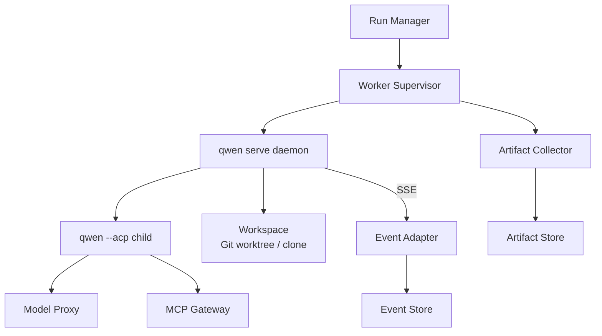

# 基于 qwen-code serve 的云端 Agent 执行单元方案

> 结论：`qwen serve` 不是 SAEU 之外还要再包装的“普通 CLI 进程”，而是 SAEU 的 Qwen Code 首选实现。它已经提供 daemon、workspace、session、HTTP/SSE、permission mediation、status、resume 等核心 worker 能力。平台外层要补的是多 daemon 编排、持久审计、artifact、model proxy、sandbox policy、租户身份和恢复控制。不要把 alpha 阶段的 qwen serve 直接暴露公网或直接当作完整生产控制面。

## 设计目标

本方案把一个受控的 qwen serve daemon 作为云端可托管 Agent 执行单元：

```text
Qwen SAEU implementation
  = Worker Supervisor
  + qwen serve daemon
  + workspace sandbox
  + event adapter
  + artifact collector
  + health/recovery controller
```

它对外暴露统一 SAEU contract，对内使用 qwen serve 的 HTTP + SSE + ACP bridge。后续当 qwen serve 支持官方 ACP Streamable HTTP `/acp` endpoint 时，adapter 应优先走标准 ACP 远程传输，而不是长期依赖 qwen 私有 REST/SSE。

## SAEU 对齐判断

qwen serve 与 SAEU 的对应关系如下：

| SAEU 要求 | qwen serve 当前能力 | 平台是否还要补 |
| --- | --- | --- |
| 独立 workspace | 一个 daemon 绑定一个 workspace | 多 workspace -> 多 daemon registry |
| Agent runtime | 一个 `qwen --acp` child process | 不需要重写 runtime |
| 多客户端连接 | HTTP + SSE，多客户端 attach | 需要接入租户/用户身份 |
| session/run 控制 | `POST /session`、single/thread scope | 需要映射到平台 run/thread/task |
| 事件流 | `GET /session/:id/events` | 需要持久化为 Event Store |
| 权限请求 | permission mediation | 需要外部审批、审计、策略 |
| 健康诊断 | health、capabilities、daemon/status、session/status | 需要 worker lease 和自动恢复 |
| 恢复 | load/resume | 需要 workspace snapshot 和 artifact |
| 工具/MCP | MCP pool、MCP restart、tool toggle | 需要工具网关和租户级权限 |

所以第一版不要再造“Agent worker”。应该做：

```text
Run Manager
  -> Worker Supervisor
  -> qwen serve daemon
  -> qwen session
  -> qwen SSE / ACP events
  -> canonical Event Store
```

如果未来接入 Claude Code、Codex、OpenCode，则替换的是 `qwen serve daemon` 这一格，而不是重写 Run Manager、Event Store、Permission Service。

## qwen serve 能力基线

从本地 Qwen Code 文档看，`qwen serve` 当前具备这些关键能力：

- 一个 daemon 绑定一个 workspace。
- daemon 内部启动一个 `qwen --acp` child process 执行真实 Agent runtime。
- 外部通过 HTTP + SSE 访问 daemon。
- 支持 `POST /session` 创建或附着 session。
- 支持 `POST /session/:id/prompt` 提交 prompt，异步返回 202。
- 支持 `GET /session/:id/events` 订阅 SSE。
- SSE 支持 `Last-Event-ID`，可在 event ring 范围内重连追赶。
- 支持 `permission_request`、`permission_resolved`、`permission_partial_vote`、`permission_forbidden`。
- 支持 `/health`、`/capabilities`、`/daemon/status`、`/session/:id/status`。
- 支持 `/session/:id/load`、`/session/:id/resume`。
- 支持 session recap、stats、context usage、tasks、LSP status 等诊断接口。
- 支持 remote runtime control，例如 approval mode、tool enable/disable、MCP server restart。

限制也必须写进设计：

- qwen serve 文档标注为 experimental / local-first。
- 容器化部署、反向代理和多 daemon 协调在 alpha 阶段不是主保证面。
- event ring 是有界缓冲，不是长期审计日志。
- 一个 daemon 等于一个 workspace，多 workspace 要多个 daemon 或外层编排。
- 生产级多客户端、长时间网络抖动和大规模连接需要外层补强。
- 当前 northbound 主要是 qwen 私有 REST/SSE；开源生态兼容应推动或适配 ACP Streamable HTTP。

## 单元拓扑



## 启动策略

### 进程模式

适合本地 POC：

```bash
export QWEN_SERVER_TOKEN="$TOKEN"
cd /srv/agent/workspaces/run-123
qwen serve \
  --host 127.0.0.1 \
  --port 4170 \
  --require-auth \
  --token "$QWEN_SERVER_TOKEN" \
  --event-ring-size 20000 \
  --prompt-deadline-ms 3600000 \
  --writer-idle-timeout-ms 300000 \
  --rate-limit
```

### 容器模式

适合云端单元：

```bash
docker run --rm \
  --name qwen-unit-run-123 \
  --memory=1024m \
  --cpus=1.0 \
  --pids-limit=256 \
  --cap-drop=ALL \
  --security-opt=no-new-privileges \
  -u 1000:1000 \
  -e QWEN_SERVER_TOKEN="$TOKEN" \
  -e OPENAI_BASE_URL="http://model-proxy:8080/v1" \
  -e OPENAI_API_KEY="proxy-scoped-token" \
  -v /srv/agent/workspaces/run-123:/workspace:rw \
  -v /srv/agent/artifacts/run-123:/artifacts:rw \
  -w /workspace \
  qwen-code-runner:latest \
  qwen serve \
    --host 0.0.0.0 \
    --port 4170 \
    --require-auth \
    --token "$QWEN_SERVER_TOKEN" \
    --event-ring-size 20000 \
    --prompt-deadline-ms 3600000 \
    --writer-idle-timeout-ms 300000 \
    --rate-limit
```

注意：

- 容器网络只允许访问 Run Manager、Model Proxy、MCP Gateway 和必要 registry。
- 不暴露到公网，只在 worker 内网或 loopback 访问。
- token 由 Worker Supervisor 生成，run 结束销毁。
- 真实模型 key 不进容器，只给 Model Proxy。

## Supervisor 职责

Worker Supervisor 是生产化关键。它不能只是 `docker run` 包装器。

| 职责 | 说明 |
| --- | --- |
| workspace 准备 | clone/worktree、设置权限、写入 run manifest |
| daemon 启动 | 分配端口、token、资源、网络、环境变量 |
| 健康检查 | 轮询 `/health`、`/capabilities`、`/daemon/status` |
| session 管理 | `POST /session`、记录 session_id、session scope |
| prompt 投递 | `POST /session/:id/prompt`，记录 prompt_id/input_id |
| SSE 订阅 | 维护 `Last-Event-ID`，断线重连 |
| 事件转换 | qwen event / ACP event -> SAEU canonical event -> Event Store |
| 权限中继 | permission request 写 DB，等待外部审批后调用 `/permission/:id` |
| artifact 收集 | transcript、events、diff、logs、diagnostics |
| 恢复控制 | daemon 崩溃后 load/resume 或重建 |
| 终止清理 | cancel、kill、collect、cleanup |

## 对外 API

Run Manager 不直接暴露 qwen serve 原始 API，而暴露稳定接口：

```http
POST /runs
GET  /runs/{run_id}
GET  /runs/{run_id}/events
POST /runs/{run_id}/input
POST /runs/{run_id}/cancel
GET  /runs/{run_id}/artifacts
GET  /runs/{run_id}/diagnostics
POST /permissions/{permission_id}/resolve
```

这样以后可以替换 worker，不影响客户端。

替换原则：

- Qwen Code adapter 调 qwen serve。
- Claude Code adapter 调 Claude 的 headless/SDK server。
- Codex adapter 调 Codex 的 CLI/API wrapper。
- OpenCode adapter 调 OpenCode session runtime。
- 原生开源 worker 直接实现 ACP server。

这些 adapter 都必须输出相同 canonical events，并接入同一个 Permission Service 和 Artifact Store。

## 事件采集

qwen serve SSE 是实时事件源，但不是唯一事实源。Supervisor 必须：

1. 首次连接 `GET /session/:id/events?maxQueued=2048`。
2. 保存每个 qwen SSE envelope 的原始 JSON 到 artifact。
3. 转换成 SAEU canonical event 写入 Postgres。
4. 记录 qwen `envelope.id` 和内部 `event_id` 的映射。
5. 断线后用 `Last-Event-ID` 重连。
6. 如果检测到 gap，标记 `event.gap_detected` 并从 qwen `/session/:id/load` 或内部 transcript 补救。

event ring 只能用于短线重连。长期审计必须依赖外部 Event Store。

## 审计设计

每个 run 结束后至少产出：

```text
artifacts/run-123/
  manifest.json
  qwen-sse.raw.jsonl
  events.canonical.jsonl
  transcript.jsonl
  permissions.jsonl
  diagnostics.start.json
  diagnostics.end.json
  stdout.log
  stderr.log
  diff.patch
  final.md
```

`manifest.json` 至少包含：

- run_id、unit_id、session_id、prompt_id。
- repo URL、commit SHA、worktree path。
- container image digest。
- qwen-code version。
- qwen serve flags。
- model provider/model，不包含真实 key。
- MCP servers 和 tool policy。
- sandbox policy。
- start/end 时间和终止原因。

审计事件必须覆盖：

- 谁创建 run。
- 谁发送 prompt。
- 谁审批权限。
- Agent 调用了什么工具。
- 工具输入输出引用。
- 产出了哪些 artifact。
- 是否发生恢复、gap、重试、取消。

## 重放设计

重放分三种：

| 类型 | 目标 | 输入 |
| --- | --- | --- |
| UI Replay | 重现用户看到的流式过程 | `events.canonical.jsonl` |
| Transcript Replay | 重建 Agent 上下文 | `transcript.jsonl`、qwen session load |
| Deterministic Debug Replay | 尽量复现问题 | workspace snapshot + model/tool fixtures |

第一版必须实现 UI Replay 和 Transcript Replay。Deterministic Debug Replay 后续做，因为它需要 mock 模型输出和工具输出。

## 可恢复设计

### 客户端断线

- Run Manager 保存最后消费的 `event_id`。
- 客户端重新 `GET /runs/:id/events?after=...`。
- 不依赖 qwen serve event ring；从 Event Store 回放。

### Supervisor SSE 断线

- 使用 qwen `Last-Event-ID` 重连。
- 比较第一个 replay event id 是否等于 `last_qwen_id + 1`。
- 无 gap：继续。
- 有 gap：写 `event.gap_detected`，调用 `/session/:id/load`，并把诊断 artifact 保存。

### qwen daemon 崩溃

- `session_died` 或 process exit 触发 `unit.recovering`。
- 保存 `diagnostics.crash.json`、stdout/stderr。
- 如果 workspace 和 transcript 完整，重启 daemon 并尝试 `/session/:id/load` 或 `/session/:id/resume`。
- 恢复成功写 `unit.recovered`。
- 恢复失败写 `run.failed`，原因 `agent_session_lost`。

### worker 节点重启

- Supervisor 启动时扫描 DB 中 `running/recovering/waiting_permission` 的 runs。
- 检查对应容器是否还在。
- 容器存在：重新订阅 SSE。
- 容器不存在：按恢复策略重建或标记 failed。

## 问题排查

排查入口：

| 问题 | 先看 |
| --- | --- |
| 没有输出 | `/session/:id/status`、SSE heartbeat、prompt_id |
| 权限卡住 | `permissions` 表、`permission_request`、timeout |
| 模型失败 | model proxy logs、usage metadata、provider error |
| 工具失败 | tool call event、stdout/stderr、exit code |
| session 崩溃 | `session_died`、daemon stderr、container exit code |
| 事件缺失 | qwen event id gap、Event Store seq gap |
| 成本异常 | model proxy token/cost、recap 调用次数 |
| 上下文爆掉 | `/session/:id/context-usage`、compaction events |

每个 run 的 diagnostics endpoint 应返回：

- unit 状态。
- qwen daemon 状态。
- session 状态。
- container 状态。
- 最近 20 个 canonical events。
- 最近 permission 状态。
- 最近 tool call 状态。
- resource usage。
- event gap 检测结果。

## 高可用策略

在 1-2 台 VPS 上，HA 不是多副本起步，而是可恢复和小爆炸半径：

| 风险 | 策略 |
| --- | --- |
| API 进程重启 | Event Store 持久化，SSE 客户端从 DB 重连 |
| Supervisor 重启 | 扫描 running runs，重新 attach 或恢复 |
| qwen daemon 崩溃 | 重启并 load/resume，失败后留完整 artifact |
| VPS 重启 | systemd 启动 API/Supervisor，恢复 running runs |
| DB 损坏 | 每日备份，artifact 可独立留存 |
| 容器逃逸 | 普通任务 Docker，风险任务独立 worker VPS |
| 模型 API 波动 | Model Proxy 做重试、限流、降级和预算 |

## 安全策略

- qwen serve 不暴露公网。
- 所有 mutation route 必须 bearer token。
- token 每个 unit 独立生成。
- `X-Qwen-Client-Id` 使用 `run-manager:<run_id>`，用于审计 attribution。
- Agent 容器不挂载 SSH key、云 credential、Docker socket。
- `.env`、密钥文件读取默认 deny 或 ask。
- tool enable/disable 由 Run Manager 根据 tool policy 管理。
- 外部网络通过 egress proxy。
- Model Proxy 替代真实模型 key。

## 最小验收

第一版完成后，应能证明：

1. 创建一个 run 会启动独立 qwen serve 单元。
2. prompt 能异步提交，事件能从 Run Manager SSE 看到。
3. permission request 能出现在 UI/API 并被审批。
4. 客户端断线后可从 Event Store 追上事件。
5. qwen serve 重启后能恢复或给出明确失败原因。
6. run 结束后 artifact 完整。
7. 任何失败都有 `failure_kind` 和 diagnostics。
8. 没有真实模型 key 或宿主机敏感路径进入 Agent 容器。

## P7 执行单元增强

当前实现已把 qwen 单 Agent 云端部署推进到“可编排执行单元”：

- `shared`：连接已有 `QWEN_SERVE_URL`，成本最低，适合单租户 beta。
- `per_run_process`：每个 qwen run 独立启动 `qwen serve`，独立端口、workspace、stdout/stderr、`executor.json` 和 lifecycle event。
- `container`：支持 `QWEN_CONTAINER_COMMAND` 自定义模板；也支持配置 `QWEN_CONTAINER_IMAGE` 后自动生成 Docker foreground worker 命令，并注入 CPU、memory、pids、端口映射、workspace mount 和 token。

关键环境变量：

```bash
QWEN_EXECUTOR_STRATEGY=per_run_process
QWEN_EXECUTOR_COMMAND='qwen serve --hostname {host} --port {port}'
QWEN_EXECUTOR_PORT_START=4210
QWEN_EXECUTOR_PORT_END=4310

QWEN_EXECUTOR_STRATEGY=container
QWEN_CONTAINER_IMAGE='your-qwen-code-image:latest'
QWEN_CONTAINER_CPUS=1
QWEN_CONTAINER_MEMORY_MB=1024
QWEN_CONTAINER_PIDS=256
```

验收入口：

```bash
python3 scripts/validate_qwen_mission.py \
  --base-url http://127.0.0.1:8765 \
  --token "$RUN_MANAGER_TOKEN" \
  --validate-single-run \
  --expect-executor-strategy per_run_process
```

排障入口：

- `/executors`：查看 executor registry、lease、pid、port、workspace、失败原因。
- `/runs/<run_id>/executor`：查看某个 run 的 executor lease。
- run artifact：`executor.json`、`executor.stdout.log`、`executor.stderr.log`、`diagnostics.json`、`cost.json`。
- ACP：`executor.list`、`run.permissions`、`cost.status`、`access.policy`。

## 暂不做

第一版不要做：

- 多 qwen daemon 之间直接互联。
- 直接把 qwen serve 暴露公网给用户。
- 把 qwen event ring 当持久化日志。
- 在没有外部 Event Store 的情况下支持长任务恢复。
- 从头改写 qwen-code core。

先把一个 qwen serve 单元做到稳定，再把它作为多 Agent 编排的调度原子。
