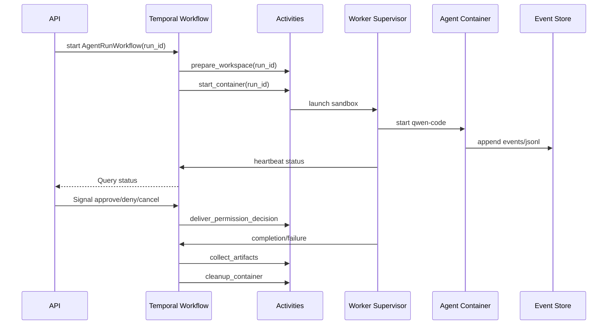

# Temporal 调研与适配方案

> 结论：Temporal 是 durable execution 平台，不是简单消息队列，也不是 Agent 框架。它适合管理长周期、可恢复、需要重试和人工介入的编排流程；不适合把整个 LLM token streaming 或 qwen-code 内部 loop 直接塞进 Workflow。

## Temporal 是什么

Temporal 把长期运行的业务流程写成普通代码，并由 Temporal Service 持久化执行历史。Worker 可以宕机、重启、迁移，Workflow 仍能从历史事件中恢复执行。

核心概念：

| 概念 | 含义 |
| --- | --- |
| Temporal Service | 持久化 workflow history、调度 task、管理状态的服务端 |
| Workflow | 长期运行、可恢复的确定性编排代码 |
| Activity | 与外部世界交互的非确定性动作，如启动容器、调用 API、写文件 |
| Worker | 运行 Workflow 和 Activity 代码的进程 |
| Task Queue | Workflow/Activity task 的分发队列 |
| Signal | 异步通知 Workflow，例如用户点击取消 |
| Query | 读取 Workflow 当前状态，不修改状态 |
| Update | 向 Workflow 发起会改变状态且可等待结果的请求 |
| Timer | 持久化定时器，用于 sleep、deadline、重试等待 |
| Event History | Temporal 用于 replay 和恢复的事件历史 |

Temporal 的关键能力是：**把“进程活着”变成“历史可恢复”**。

## 与普通队列的差异

| 问题 | 普通队列 | Temporal |
| --- | --- | --- |
| 任务执行到一半 worker 宕机 | 需要自己记录进度 | Workflow history 可恢复 |
| 等待人工审批数小时 | 需要 DB 状态机 + 定时器 | Workflow 可等待 Signal/Update |
| 重试和补偿 | 手写逻辑 | SDK 原生支持 retry、timeout、timer |
| 查询长任务状态 | 读业务 DB | Query/业务 DB 都可 |
| 多步骤幂等 | 需要自己维护 | Activity 仍需幂等，但编排历史可靠 |
| 代码升级 | 自己处理兼容 | 需要 Temporal versioning 纪律 |

Temporal 不能消除所有复杂度。Activity 调外部系统仍然要设计幂等键、重试策略和补偿逻辑。

## 适合 Agent 系统的部分

Temporal 适合管这些：

- 创建 run。
- 分配 worker。
- 启动 sandbox 容器。
- 等待 Agent 事件或完成信号。
- 等待人工审批。
- 处理超时、取消、重试。
- 在失败后执行清理和补偿。
- 多 Agent 子任务 fan-out/fan-in。
- 定期唤醒长周期任务。

Temporal 不适合管这些：

- 每个 token delta。
- 高频工具 stdout streaming。
- 大型 JSONL 或日志全文。
- 直接保存完整 workspace。
- 直接执行 qwen-code model loop。

这些内容应当放到 Event Store、artifact 文件或对象存储中，Temporal 只保存引用和关键状态。

## 当前 POC

当前仓库没有引入 Temporal SDK，也不启动 Temporal Service。P5.3 只提供 workflow plan export：

- `GET /temporal/workflows/runs/{run_id}/plan` 导出 `AgentRunWorkflow` 草案。
- `GET /temporal/workflows/missions/{mission_id}/plan` 导出 `MissionWorkflow` 草案。

这些 plan 会列出 Activity、Signal、Query、event-store ref 和 artifact ref，用来审计“如果引入 Temporal，哪些状态应该进入 Workflow history，哪些仍留在业务 Event Store”。

POC 边界：

- 不保存 token delta、tool stdout 或大 artifact 到 Temporal history。
- 不替代当前 Run Manager queue/reconcile。
- 不提供 Temporal Worker、Task Queue 或 SDK workflow 代码。
- 后续接入 Temporal 时，优先把 `mission -> task` 的粗粒度 DAG 编排迁移为 Workflow，SAEU run 仍作为 Activity/外部执行单元。

## Agent Workflow 草案



Workflow 只做编排，不承载大流量事件。Agent 事件流直接写 Event Store，Workflow 通过 heartbeat、signal 或 lightweight activity result 了解关键状态。

## 为什么不要把 qwen-code loop 放进 Workflow

Temporal Workflow 代码需要确定性。LLM 调用、shell 命令、文件系统状态、网络请求、随机数、时间和 token streaming 都是非确定性的。

正确拆法：

| 动作 | 放哪里 |
| --- | --- |
| 决定 run 进入哪个状态 | Workflow |
| 调用模型 | Activity 或 Agent worker |
| 执行 shell | Agent worker/sandbox |
| 保存 JSONL | Event Store/artifact |
| 等待审批 | Workflow Signal/Update + DB permission |
| 重试启动容器 | Workflow + Activity retry |
| 清理 workspace | Activity |

## 低资源部署判断

Temporal 自托管需要 Temporal Service、数据库、worker，通常还会加 UI 和 observability。对 1-2 台小 VPS，建议分阶段：

### 阶段 A：不上 Temporal

使用：

- Postgres `runs` 表。
- Postgres `jobs` 表。
- `events` append-only 表。
- worker lease/heartbeat。
- cron 或轻量调度器扫描超时任务。

适合：

- 并发 1-2 个 Agent。
- 任务时长几十分钟。
- 人工审批不复杂。
- 主要目标是验证 Agent worker、沙箱和事件模型。

### 阶段 B：单机 Temporal

当出现这些需求再引入：

- 任务经常跨小时或跨天。
- 等待人工审批是常态。
- 多 Agent fan-out/fan-in 增多。
- worker 宕机恢复变成主要痛点。
- 手写 DB 状态机开始变复杂。

部署：

```text
VPS-1
  Temporal Service
  Postgres
  API
  worker
  optional Temporal UI
```

注意：

- 不把 Temporal Web/UI 暴露公网。
- 使用 Postgres 持久化。
- 给 Temporal 和 Agent worker 分内存上限。
- 做数据库备份。

### 阶段 C：控制面和 worker 分离

```text
VPS-1: Temporal + API + Postgres
VPS-2: Agent worker + Docker sandbox
```

这时 Temporal 的 Task Queue 可以把任务分发给 worker 节点。

## Temporal 与事件溯源的关系

Temporal 自己有 workflow event history，但它不是业务审计日志的完整替代。

建议：

- Temporal history 负责恢复编排代码。
- 业务 Event Store 负责 run、tool、permission、artifact 的审计和回放。
- JSONL 负责与 Agent transcript 兼容和离线调试。

不要把所有 token delta、stdout、tool output 塞进 Temporal history，否则 history 会变大，replay 成本高，也不便于长期归档。

## 最小 Workflow 设计

一个 `AgentRunWorkflow` 足够起步：

输入：

- run_id
- tenant_id
- repo_ref
- prompt_ref
- agent_type
- sandbox_policy
- timeout

主要步骤：

1. `prepare_workspace`
2. `reserve_worker`
3. `start_agent_container`
4. `wait_for_completion_or_signal`
5. `handle_permission_signal`
6. `collect_artifacts`
7. `cleanup`
8. `mark_terminal_state`

关键规则：

- 所有 Activity 使用 `run_id` 作为幂等键。
- 容器启动、停止、artifact 收集都要能重复调用。
- Workflow 中只保存小对象和引用。
- 大对象写 artifact store。
- run 状态仍写业务 DB，方便 API 和 UI 直接查询。

## 选型建议

| 阶段 | 建议 |
| --- | --- |
| POC | 不上 Temporal，先做 Postgres queue 和 event store |
| MVP | 仍可不上 Temporal，除非人工审批和长任务已经明显复杂 |
| Beta | 引入 Temporal 管 run lifecycle 和 multi-agent fan-out/fan-in |
| Production | Temporal + 独立 worker pool + OTel + DB backup + versioning discipline |

Temporal 是好东西，但它应该在系统已经知道自己要“耐久地编排什么”之后再上。否则会在还没稳定 Agent worker 前，先被 workflow infra 的复杂度拖住。

## 参考资料

- [Temporal Workflows](https://docs.temporal.io/workflows)
- [Temporal Task Queues](https://docs.temporal.io/task-queue)
- [Temporal Workers](https://docs.temporal.io/workers)
- [Temporal Signals, Queries, Updates](https://docs.temporal.io/handling-messages)
- [Temporal Workflow message passing](https://docs.temporal.io/encyclopedia/workflow-message-passing)
- [Temporal self-hosted deployment](https://docs.temporal.io/self-hosted-guide/deployment)
