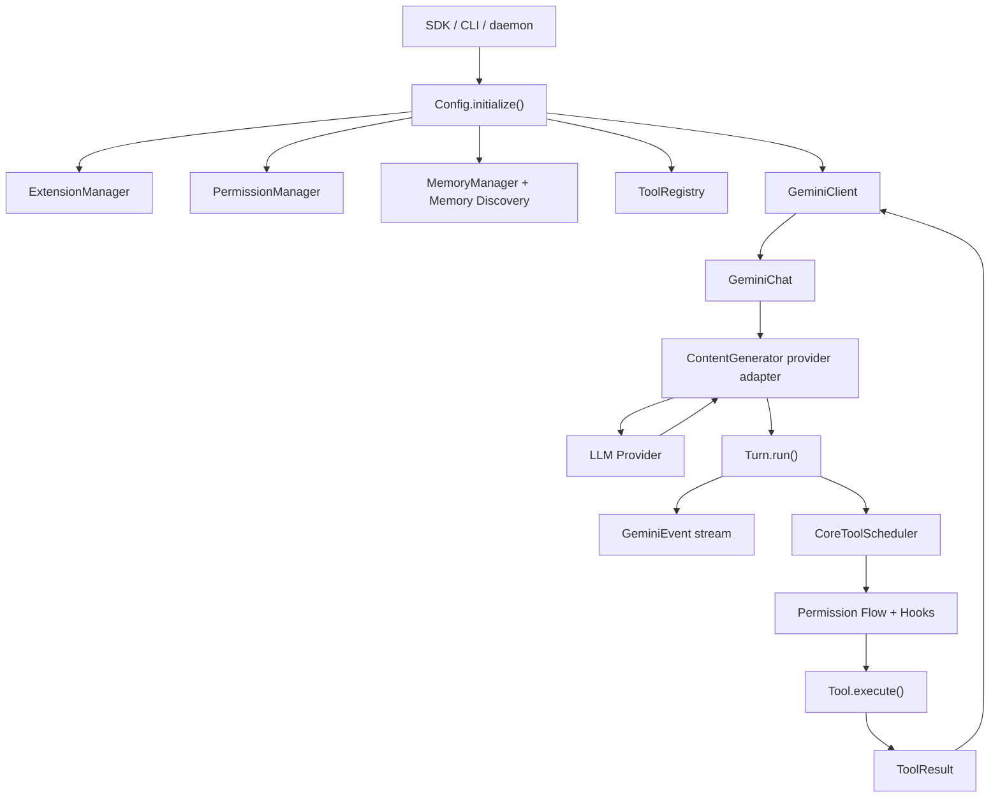
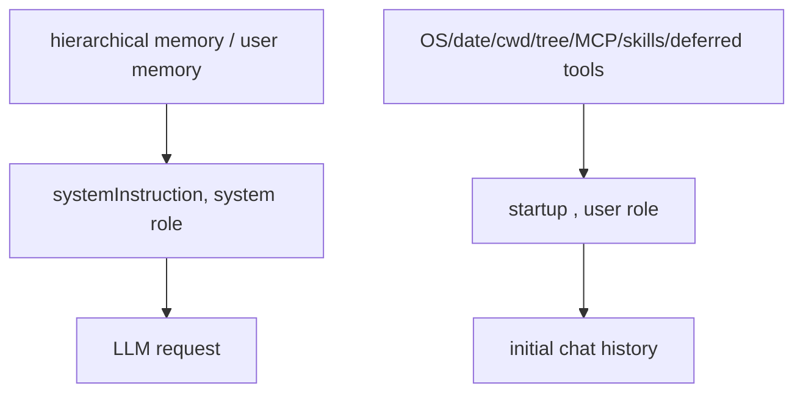
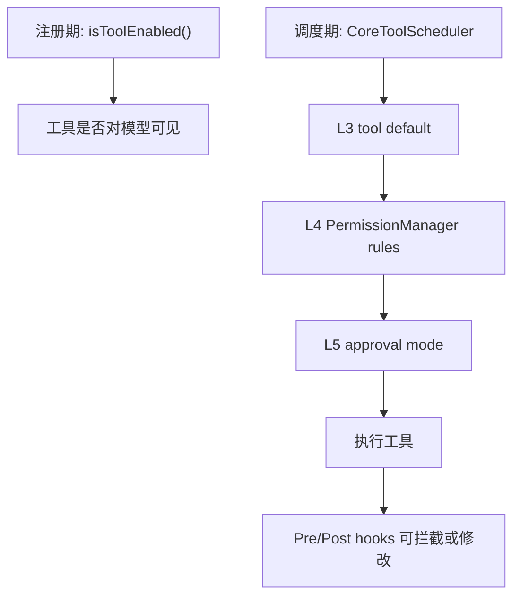
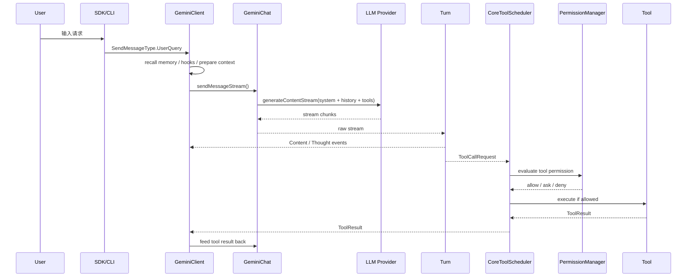

# Qwen Code Core 与 SDK Agent 架构分析

生成日期：2026-06-30  
源码目录：`/Users/chigao/Documents/codebase/github/qwen-code`  
重点范围：`packages/core`、`packages/sdk-typescript`、`packages/sdk-python`  
弱化范围：Web、Channel、VS Code 插件等外层产品形态

## 1. 总览结论

Qwen Code 的 Agent 核心不是一个单独的 `Agent` 类，而是一组运行时组件协作出来的：

- `Config`：会话级总装配器，负责模型、工具、权限、memory、extension、MCP、hooks、cron 等依赖的初始化与持有。
- `GeminiClient`：Agent 对话主入口，承接用户消息、cron 消息、工具结果、retry、notification、teammate 等输入类型。
- `GeminiChat`：模型请求与历史管理层，负责 system instruction、history、压缩、重试、orphan tool call 修复、provider content generator 调用。
- `Turn`：单轮模型流式输出解析器，把模型 stream 转换成内容、thought、tool call、citation、finish 等事件。
- `CoreToolScheduler`：工具调用调度器，做校验、权限、hooks、并发、安全策略、执行、结果回填。
- `ToolRegistry`：工具注册中心，收纳内置工具、MCP 工具、deferred tool、skill tool、cron tool 等。
- `PermissionManager`：权限规则评估中心，贯穿工具注册期、调度期和执行期。
- `MemoryManager` 与 hierarchical memory discovery：负责长期记忆、团队记忆、项目指令文件、规则文件、自动 recall/extract/dream。
- `ExtensionManager` 与 `SkillManager`：插件、扩展、skill、MCP server、hooks、commands、agents 的贡献源。
- `CronScheduler` 与 `LoopDetectionService`：一个负责未来唤醒，一个负责当前 agent loop 的止损。
- SDK：主要通过 CLI 子进程的 JSONL 协议接入 core runtime；TypeScript SDK 最完整，Python SDK 是较轻的进程封装。

核心数据流可以概括为：



## 2. 关键源码入口

### 2.1 Core 主链路

| 主题 | 文件 |
| --- | --- |
| 会话装配 | `packages/core/src/config/config.ts` |
| Agent 主入口 | `packages/core/src/core/client.ts` |
| 模型聊天与 history | `packages/core/src/core/geminiChat.ts` |
| 单轮响应解析 | `packages/core/src/core/turn.ts` |
| 工具调度 | `packages/core/src/core/coreToolScheduler.ts` |
| 系统提示词 | `packages/core/src/core/prompts.ts` |
| 启动上下文 reminder | `packages/core/src/utils/environmentContext.ts` |
| 工具注册 | `packages/core/src/tools/tool-registry.ts` |
| MCP 管理 | `packages/core/src/tools/mcp-client-manager.ts` |
| MCP client | `packages/core/src/tools/mcp-client.ts` |
| MCP 工具包装 | `packages/core/src/tools/mcp-tool.ts` |
| memory discovery | `packages/core/src/utils/memoryDiscovery.ts` |
| managed memory | `packages/core/src/memory/manager.ts` |
| 权限管理 | `packages/core/src/permissions/permission-manager.ts` |
| 权限流 | `packages/core/src/core/permissionFlow.ts` |
| auto mode | `packages/core/src/permissions/autoMode.ts` |
| extension | `packages/core/src/extension/extensionManager.ts` |
| skill manager | `packages/core/src/skills/skill-manager.ts` |
| skill tool | `packages/core/src/tools/skill.ts` |
| cron scheduler | `packages/core/src/services/cronScheduler.ts` |
| 创建 cron | `packages/core/src/tools/cron-create.ts` |
| loop wakeup | `packages/core/src/tools/loop-wakeup.ts` |
| loop detection | `packages/core/src/services/loopDetectionService.ts` |
| provider 抽象 | `packages/core/src/core/contentGenerator.ts` |
| side LLM client | `packages/core/src/core/baseLlmClient.ts` |
| OpenAI 兼容 provider | `packages/core/src/core/openaiContentGenerator/openaiContentGenerator.ts` |

### 2.2 SDK 入口

| SDK | 文件 |
| --- | --- |
| TS createQuery | `packages/sdk-typescript/src/query/createQuery.ts` |
| TS Query runtime | `packages/sdk-typescript/src/query/Query.ts` |
| TS 子进程 transport | `packages/sdk-typescript/src/transport/ProcessTransport.ts` |
| TS 类型 | `packages/sdk-typescript/src/types/types.ts` |
| TS 协议 | `packages/sdk-typescript/src/types/protocol.ts` |
| Python query | `packages/sdk-python/src/qwen_code_sdk/query.py` |
| Python transport | `packages/sdk-python/src/qwen_code_sdk/transport.py` |
| Python 类型 | `packages/sdk-python/src/qwen_code_sdk/types.py` |
| Python 校验 | `packages/sdk-python/src/qwen_code_sdk/validation.py` |

## 3. 初始化与总装配

`Config.initialize()` 是 core runtime 的总装配入口。它不是只读配置对象，而是会把一整套运行时服务拼起来。

典型初始化顺序：

1. 读取 settings、model、workspace、approval mode、sandbox、telemetry 等会话参数。
2. 初始化 `PermissionManager`，加载用户、项目、extension、runtime overlay 里的权限规则。
3. 在非 bare/safe 场景刷新 extension cache，把 extension contribution 合并进运行时。
4. 执行 `refreshHierarchicalMemory('session_start')`，读取全局、项目层级和目录层级指令文件。
5. 创建并持有 `ToolRegistry`。
6. 初始化 `GeminiClient`，把 model、content generator、tool scheduler 等接上。
7. warm 内置工具工厂，注册基础工具。
8. 启动 MCP discovery。交互模式下通常走 progressive background discovery，避免启动时被慢 MCP server 卡住；非交互模式会更偏向等待 MCP ready。
9. 初始化 telemetry、runtime diagnostics、stale worktree sweep 等辅助服务。

从设计上看，`Config` 是依赖图根节点。很多运行时组件不直接互相 new，而是通过 `config.getXxx()` 间接访问，降低入口复杂度，但也意味着排查行为时经常需要从 `Config` 回溯。

## 4. Agent 主循环

### 4.1 `GeminiClient.sendMessageStream()`

`GeminiClient` 是 core 对外最重要的流式入口。它接收的消息类型不只是用户输入，还包括：

- `UserQuery`：普通用户请求。
- `ToolResult`：工具执行结果回灌给模型。
- `Retry`：失败或中断后的重试。
- `Hook`：hook 触发的消息。
- `Cron`：定时任务触发的 prompt。
- `Notification`：外部通知类消息。
- `Teammate`：团队/多 agent 协作消息。

`sendMessageStream()` 的主要职责：

1. 根据消息类型准备当前请求上下文。
2. 触发 memory recall。`UserQuery` 和 `Cron` 会启动异步 recall，若及时完成则注入当前请求，若工具调用已经开始则延后到后续 `ToolResult`。
3. 运行 user prompt submit 等 hook。Cron 路径会跳过部分用户提交 hook，避免未来唤醒 prompt 被当作真实用户提交。
4. 调用 `GeminiChat.sendMessageStream()` 请求模型。
5. 用 `Turn.run()` 消费模型 stream，产生内容事件和 tool call 请求。
6. 将 tool call 交给 `CoreToolScheduler`。
7. 监听工具结果，再把 `ToolResult` 作为下一次输入喂回模型。
8. 在 UserQuery 后台调度 memory extract、dream、skill review 等。

### 4.2 `GeminiClient.startChat()`

`startChat()` 负责构造一场 agent 会话：

1. warm `ToolRegistry`，确保工具 schema 可用。
2. resume session 时重新 reveal deferred tools，避免历史会话丢掉可用工具。
3. 通过 `getInitialChatHistory()` 生成 startup prelude。
4. 创建 `GeminiChat(systemInstruction, history)`。
5. 修复 history 中 orphan tool use / tool response。
6. 跑 SessionStart hook。
7. 调用 `setTools()`，把当前可用工具声明传给模型。

### 4.3 `GeminiChat`

`GeminiChat` 是 provider 请求层。它内部维护两份 history：

- comprehensive history：完整历史，用于尽可能保存细节。
- curated history：压缩或整理过的历史，用于控制上下文窗口。

关键行为：

- 自动压缩：上下文接近限制时会压缩历史。
- hard-rescue：遇到 context overflow 时会尝试救援式压缩和重发。
- retry：根据 provider 错误类型和 retry policy 重试。
- partial response 持久化：模型流式输出中的部分 assistant 内容会进入 history。
- orphan tool use repair：修复模型工具调用和工具结果不成对的问题。
- provider 抽象：通过 `config.getContentGenerator().generateContentStream()` 调用真实模型。

### 4.4 `Turn`

`Turn.run()` 是模型流解析器。它消费 provider 返回的 stream，把原始响应拆成 core 事件：

- `Thought`：模型思考或 reasoning 片段。
- `Content`：面向用户的文本输出。
- `ToolCallRequest`：function call。
- `Citation`：引用信息。
- `Finished`：单轮结束原因。

Function call 会被转换成 `ToolCallRequestInfo`，其中包含：

- tool name。
- tool args。
- call id。
- provider call id。
- response id。
- 输出是否被截断。

这些信息后续会被 `CoreToolScheduler` 使用，尤其是权限、截断保护、工具结果对应关系。

## 5. 系统提示词体系

Qwen Code 的提示词不是单层文本，而是两层组合：



### 5.1 `core/prompts.ts`

`packages/core/src/core/prompts.ts` 生成真正的 system role instruction。

主要内容：

- Qwen Code 身份与边界。
- 工程协作规则。
- 代码修改规范。
- git 安全规则。
- 工具使用规则。
- sandbox/approval 相关提示。
- 用户 memory 拼接。

可配置入口：

- `QWEN_SYSTEM_MD`：用外部 Markdown 覆盖默认系统提示词。
- `QWEN_WRITE_SYSTEM_MD`：把最终系统提示词写出，便于调试。
- CLI/SDK 的 `--system-prompt`：覆盖 system prompt。
- CLI/SDK 的 `--append-system-prompt`：追加 system prompt。
- `userMemory`：通过分隔线拼接进 system instruction。

这意味着最终 system prompt 可能来自默认模板、环境变量、CLI/SDK 参数、项目 memory 多源叠加。研究 prompt 行为时不能只看 `prompts.ts` 默认文本。

### 5.2 `environmentContext.ts`

`packages/core/src/utils/environmentContext.ts` 生成 startup context，通常以 user role 的 `<system-reminder>` 形式放入初始 history。

它包含：

- 当前日期。
- OS。
- 当前工作目录。
- 项目目录结构摘要。
- deferred tools 的提示。
- MCP server instructions。
- available skills。
- 压缩后恢复 startup context 所需的信息。

为什么这部分不是 system role：它更像“本次会话环境快照”，需要在 history 中被模型看见，也能在压缩后重新注入。

### 5.3 memory 与 prompt 的关系

memory 有两种不同形态：

1. 指令型 memory：例如 `QWEN.md`、`AGENTS.md`、rules，通常会进入 system prompt 或 startup reminder。
2. managed memory：长期记忆检索结果，通常会在具体 user query 或 cron query 附近注入。

这两类 memory 的生命周期、可信边界和注入时机不同，不能混为一个“记忆模块”理解。

## 6. 工具系统

### 6.1 `ToolRegistry`

`ToolRegistry` 是工具注册中心。它会收纳：

- 内置文件工具：read、write、edit、glob、grep、ls 等。
- shell 工具。
- web fetch。
- todo、task、agent、team、workflow 等运行时工具。
- cron 工具。
- loop wakeup 工具。
- skill tool。
- MCP tools。
- deferred tools。

工具注册通常会先经过 `PermissionManager.isToolEnabled()`。这意味着某些工具在模型看来可能根本不存在，而不是存在但调用时被拒。

### 6.2 tool declaration 与 deferred tool

Qwen Code 支持 deferred tool 机制：不是所有工具都一开始作为 function declaration 发给模型。部分工具会先通过 startup reminder 或 `tool_search` 暴露给模型，模型需要时再 reveal。

这样做的价值：

- 控制 tool schema token 成本。
- 避免大量 MCP 工具污染模型选择空间。
- 支持渐进发现。

当 deferred tool 被 reveal 后，`setTools()` 会更新发给模型的工具声明。

### 6.3 `CoreToolScheduler`

`CoreToolScheduler` 是工具执行的核心状态机。

典型状态：

- validating。
- scheduled。
- executing。
- waiting for approval。
- success。
- error。
- cancelled。

主要职责：

1. tool call 参数校验。
2. validation retry 与 loop detection。
3. 截断保护，例如 edit 参数被模型输出截断时拒绝执行。
4. 权限流判断。
5. PreToolUse / PostToolUse / PostToolBatch hooks。
6. PermissionRequest hook。
7. 非交互模式下的 approval fail closed。
8. background agent 下的工具限制。
9. tool span 与 telemetry。
10. 根据工具安全等级决定并发执行。

工具调度是 Agent 行为安全性的第二道门。第一道门是注册期是否暴露工具，第三道门是工具执行时的 hook 和实际 tool 内部保护。

## 7. 权限体系

权限体系大致分三段：



### 7.1 权限模式

常见 approval / permission mode：

- default。
- plan。
- auto-edit。
- auto。
- yolo。

不同 mode 影响：

- 哪些工具天然可用。
- 文件写入是否自动允许。
- shell 是否需要确认。
- 是否进入计划模式限制。
- 是否启用 auto classifier。

### 7.2 L3/L4/L5

可以粗略理解为：

- L3：工具自身默认权限等级和安全类型。
- L4：`PermissionManager` 的 allow/ask/deny 规则。
- L5：当前 approval mode 的最终策略。

规则优先级中，deny 最高。allow 并不总是直接放行，有些受保护路径或高风险操作会强制进入更严格检查。

### 7.3 Auto mode

`packages/core/src/permissions/autoMode.ts` 是自动权限策略的关键。

Auto mode 的核心逻辑：

1. 安全工具 allowlist 可以直接通过。
2. workspace edit 可能走 fast path。
3. 风险路径或不确定操作交给 LLM classifier。
4. classifier 不可用或结果不安全时 fail closed。

受保护范围包括：

- `.git`。
- `.husky`。
- `package.json`。
- `.npmrc`。
- `Makefile`、`justfile`、`Taskfile`。
- GitHub workflows。
- `.qwen/settings*.json`。
- `QWEN.md`、`AGENTS.md`。
- `.qwen/rules`、`.qwen/commands`、`.qwen/agents`、`.qwen/skills`、`.qwen/hooks`。
- `.mcp.json`。
- QWEN_HOME 相关配置面。

### 7.4 Shell 权限

shell 不是简单按命令字符串做 allow/deny。`PermissionManager.evaluate()` 会解析 shell 操作，并将其映射成虚拟操作：

- Read。
- Edit。
- Write。
- WebFetch。

同时还会跟踪 compound command 中的 cwd 变化。这样规则可以覆盖 shell 间接文件操作，而不是只能管 `read_file`、`write_file` 这种显式工具。

Shell 默认权限也会结合 AST read-only checker 判断。只读命令和写操作的权限路径不同。

## 8. MCP 架构

### 8.1 MCP 来源

MCP server 配置来源会合并：

- settings。
- extension contribution。
- runtime overlay。
- SDK 传入的 MCP server。

合并后还会经过过滤：

- `excludedMcpServers`。
- `allowedMcpServers`。
- `pendingMcpServers`。
- recently removed server。
- trust 相关过滤。

### 8.2 Discovery 策略

Qwen Code 默认偏 progressive discovery。

交互模式：

- 初始化时不阻塞等待所有 MCP 工具发现完成。
- 后台执行 `startMcpDiscoveryInBackground()`。
- 发现完成后更新工具、prompt、resource registry。

非交互模式：

- 更倾向调用 `waitForMcpReady()`，避免 headless 场景里模型看不到必要工具。

这样可以在 CLI/TUI 中减少冷启动延迟，同时仍让 MCP 工具逐步可用。

### 8.3 MCP 能贡献什么

MCP server discovery 后会产生三类能力：

- tools：包装成 `DiscoveredMCPTool`，进入 `ToolRegistry`。
- prompts：进入 `PromptRegistry`，之后可以作为 model-invocable command 被 skill tool 或命令系统调用。
- resources：进入 `ResourceRegistry`，通过 `read_mcp_resource` 读取。

### 8.4 Deferred MCP tools

MCP tools 很适合 deferred：

- MCP server 可能提供大量工具。
- 每个工具 schema 可能较长。
- 一开始全量暴露会显著增加上下文压力。

因此 MCP 工具可以先只在 `<system-reminder>` 或 `tool_search` 里作为可发现项出现。模型明确需要时，才 reveal 并把 schema 放入 tools declaration。

### 8.5 MCP transport 与认证

core 支持多类 MCP transport：

- stdio。
- SSE。
- streamable HTTP。
- websocket placeholder。
- SDK transport。

认证相关能力：

- OAuth。
- token storage。
- Google credentials。
- service account impersonation。

还有一些运行时控制：

- MCP status global registry。
- workspace budget guardrail，支持 warn/enforce/off。
- client budget。
- daemon 场景下的 shared MCP transport pool。

## 9. Memory 架构

Qwen Code 的 memory 分两大系统：hierarchical instruction memory 和 managed auto-memory。

### 9.1 Hierarchical instruction memory

关键文件：

- `packages/core/src/utils/memoryDiscovery.ts`。
- `packages/core/src/utils/memoryImportProcessor.ts`。
- `packages/core/src/utils/rulesDiscovery.ts`。

会读取：

- 全局 `QWEN.md`。
- 项目或目录中的 `QWEN.md`。
- `AGENTS.md`。
- `.qwen/QWEN.local.md`。
- `.qwen/rules/`。

重要行为：

- 全局 QWEN 总会查。
- 工作区向上扫描需要 trusted folder。
- imports 最大深度为 5，避免无限导入。
- `.qwen/rules/` baseline rules 会进入 system prompt。
- conditional rules 会进入 registry，按路径或条件激活。

这套 memory 更像“项目宪法”和“局部工作规约”，优先级高，生命周期偏静态。

### 9.2 Managed auto-memory

关键文件：

- `packages/core/src/memory/manager.ts`。
- `packages/core/src/memory/recall.ts`。
- `packages/core/src/memory/extract.ts`。
- `packages/core/src/memory/dream.ts`。
- `packages/core/src/memory/store.ts`。
- `packages/core/src/memory/team-memory-sync.ts`。

典型生命周期：

1. `UserQuery` 或 `Cron` 开始时，后台异步 `recall()`。
2. recall 如果很快完成，则注入当前请求。
3. 如果工具调用已经开始，recall 结果会延迟到后续 `ToolResult` 再追加。
4. UserQuery 结束后后台 `scheduleExtract()`，抽取值得记住的信息。
5. 后台 `scheduleDream()`，整理和升华已有 memory。
6. 后台 `scheduleSkillReview()`，评估是否应沉淀或更新 skill。

managed memory 有 memory pressure gate，避免在上下文压力过高时继续注入过多内容。

### 9.3 Team memory

团队记忆只在 trusted workspace 中启用，并带有额外安全检查：

- git shareability 检查。
- symlink 检查。
- 路径逃逸检查。
- secret guard。

这说明 Qwen Code 不把 memory 只看成个人数据，还考虑了多人/多 agent 协作时的共享安全边界。

## 10. Plugin、Extension 与 Skill

### 10.1 Extension 是 core 中的插件主体

Qwen Code core 里“plugin”更具体的实现形态主要是 extension。

`ExtensionManager` 支持 extension 贡献：

- MCP servers。
- context files。
- settings。
- commands。
- skills。
- subagents。
- hooks。
- channels。

Extension 支持：

- 启用/禁用状态。
- marketplace/source registry。
- GitHub/npm/archive 安装。
- 变量替换。
- 本地化。
- 用户偏好。
- contribution 合并与覆盖。

因此 extension 是能力注入层，MCP、skill、hooks、commands 都可以由 extension 带进 core。

### 10.2 SkillManager

Skill 目录形态通常是：

```text
<skill-name>/
  SKILL.md
```

Skill 来源优先级：

1. project。
2. user。
3. extension。
4. bundled。

`SkillManager` 会扫描 project/user/extension/bundled 四层 skill，读取 `SKILL.md` frontmatter 与正文。

特性：

- watcher 最大深度 2。
- 忽略 `.git` 和特殊文件。
- 支持 disabled skills。
- 支持 path-activated conditional skills。
- 支持 `allowedTools`。
- 支持 skill hooks 注册。

### 10.3 Skill tool

`packages/core/src/tools/skill.ts` 提供模型可调用的 skill 工具。

设计特点：

- Skill tool 自身描述相对静态。
- 可用 skill 列表通过 `<available_skills>` reminder 动态告诉模型。
- 模型调用某个 skill 后，skill body 被注入上下文。
- skill 的 `allowedTools` 会转成 session allow rule。
- skill hooks 会注册到当前会话。
- 如果存在同名 model-invocable command 或 MCP prompt，skill tool 可以委派调用。

这套设计让 skill 不需要一开始把所有正文都塞进 system prompt，而是在模型明确要用时再展开。

## 11. Hooks

Hooks 是贯穿 core 的横切机制。它们可以来自 settings、extension、skill 等。

常见触发点：

- SessionStart。
- UserPromptSubmit。
- PreToolUse。
- PostToolUse。
- PostToolBatch。
- PermissionRequest。
- Stop。

Hook 能做的事情包括：

- 修改 prompt。
- 阻止工具调用。
- 改写工具参数。
- 添加上下文。
- 记录外部事件。
- 参与权限确认。

安全上，trusted hooks 与非 trusted hooks 会有边界。对工具调用来说，hooks 是权限体系之外的又一层可编程策略面。

## 12. 定时任务与 Loop Wakeup

### 12.1 CronScheduler

关键文件：

- `packages/core/src/services/cronScheduler.ts`。
- `packages/core/src/tools/cron-create.ts`。
- `packages/core/src/tools/cron-list.ts`。
- `packages/core/src/tools/cron-delete.ts`。

Cron 类型：

- 标准 5-field cron job。
- session-only job。
- durable job。

一些约束：

- job 上限约 50。
- recurring job 最大年龄约 7 天。
- recurring 触发有 jitter，最多约 10%，上限 15 分钟。
- one-shot 在 `:00` 或 `:30` 附近可能最多提前约 90 秒唤醒。
- durable job 会按项目持久化到用户 runtime 目录，并处理 lock、takeover、catch-up、missed 等。

Cron 触发后，本质上是把 prompt 作为 `SendMessageType.Cron` 放回 `GeminiClient.sendMessageStream()`。

### 12.2 cron_create 权限

`cron_create` 默认需要 ask。原因是 cron 会在未来重新把 prompt 喂给有完整工具权限的 Agent。如果让它轻易自动创建，就可能绕过当前会话的 auto classifier 或人工确认。

### 12.3 loop_wakeup

关键文件：

- `packages/core/src/tools/loop-wakeup.ts`。

`loop_wakeup` 是 session-only one-shot wakeup：

- 秒级延迟。
- 不持久化。
- 不计入 cron job 上限。
- 通常 clamp 在 60 到 3600 秒。
- chain 最大约 24 小时。

它适合 agent 在当前任务里安排短期自我唤醒，例如等待外部状态、稍后检查某个进程、循环监控但不想落入无限 loop。

## 13. Loop Detection

关键文件：

- `packages/core/src/services/loopDetectionService.ts`。

Qwen Code 有多层 loop 止损：

- `MAX_TURNS = 100`，限制模型-工具往返轮数。
- 连续相同工具调用检测。
- shell inspection 停滞检测。
- 单轮工具调用数量上限，约 100。
- 重复 content/thought 检测。
- read-file loop 检测。
- ABAB 工具交替模式检测。
- validation retry loop 检测。

这说明 Qwen Code 不只防“模型一直说话”，还防“模型反复调用同一工具”“读同一批文件”“工具参数校验反复失败”“shell 检查没有进展”等工程 agent 中常见卡死形态。

Loop detection 的处理通常不是简单 kill，而是把信号反馈给调度和上层，让 agent 有机会停下、总结、或请求用户介入。

## 14. Provider 抽象

虽然类名保留了 `GeminiClient` / `GeminiChat`，但 core 内部并不只支持 Gemini。

关键抽象：

- `packages/core/src/core/contentGenerator.ts`。
- `packages/core/src/core/baseLlmClient.ts`。
- `packages/core/src/core/openaiContentGenerator/openaiContentGenerator.ts`。
- `packages/core/src/core/anthropicContentGenerator/anthropicContentGenerator.ts`。
- `packages/core/src/core/geminiContentGenerator/geminiContentGenerator.ts`。

内部消息结构大量使用 Google GenAI 的 `Content` / `Part` 形状作为统一中间表示，然后由各 provider adapter 转换：

- Gemini。
- OpenAI-compatible。
- Anthropic。
- Qwen/DashScope。
- DeepSeek。
- ModelScope。
- MiniMax。
- Mistral。
- Mimo。
- Vertex 等。

`BaseLlmClient` 还承担 side queries：

- permission classifier。
- memory recall/extract/dream。
- compression。
- 其他非主对话模型调用。

它支持 per-model generator cache，避免重复初始化 provider client。

## 15. TypeScript SDK

TypeScript SDK 是最完整的 SDK。

### 15.1 进程式接入

核心文件：

- `packages/sdk-typescript/src/query/createQuery.ts`。
- `packages/sdk-typescript/src/query/Query.ts`。
- `packages/sdk-typescript/src/transport/ProcessTransport.ts`。

SDK 会启动 CLI 子进程，大致命令形态：

```text
qwen --input-format stream-json --output-format stream-json --channel=SDK ...
```

通信方式是 JSONL 双向流：

- stdin 发送用户消息、控制响应、MCP message 等。
- stdout 接收 assistant/system/result/partial/control request 等事件。

### 15.2 Query runtime

`Query` 负责：

- 初始化 transport。
- 发送 initial prompt。
- 处理 event stream。
- 暴露 async iterable。
- 支持 interrupt。
- 支持 set_model。
- 支持 set_permission_mode。
- 支持 mcp_server_status。
- 处理 permission callback `canUseTool`。
- 处理 SDK MCP server 的 `mcp_message`。

### 15.3 SDK MCP server

TypeScript SDK 支持把 SDK 侧 MCP server 接入 core。

关键文件：

- `packages/sdk-typescript/src/mcp/SdkControlServerTransport.ts`。
- `packages/sdk-typescript/src/mcp/createSdkMcpServer.ts`。
- `packages/sdk-typescript/src/mcp/tool.ts`。
- daemon 版对应目录：`packages/sdk-typescript/src/daemon-mcp/`。

初始化时，SDK 会先连接本地 SDK MCP server instances，然后把相关信息放到 initialize control request 中，让 core 能把这些 MCP server 纳入 discovery 和 tool registry。

### 15.4 TS SDK 类型能力

TS SDK 类型覆盖较完整：

- SDKUserMessage。
- assistant message。
- system message。
- result message。
- partial message。
- control request/response。
- permission mode。
- hooks。
- MCP server。
- agent/subagent 配置。

这使 TS SDK 更适合做嵌入式 agent runner、IDE/daemon 桥接、服务端编排。

## 16. Python SDK

Python SDK 是更轻的进程封装。

关键文件：

- `packages/sdk-python/src/qwen_code_sdk/query.py`。
- `packages/sdk-python/src/qwen_code_sdk/transport.py`。
- `packages/sdk-python/src/qwen_code_sdk/types.py`。
- `packages/sdk-python/src/qwen_code_sdk/validation.py`。

它同样通过 CLI 子进程和 stream-json 协议通信，但能力不如 TS SDK 完整：

- Python SDK v1 不支持 `mcp_message`。
- `validation.py` 会拒绝 `mcp_servers`。
- Python `PermissionMode` 中缺少 TS 侧已有的部分模式，例如 `auto`。

因此如果研究“SDK 如何完整接入 core Agent 能力”，TS SDK 更有代表性；Python SDK 更适合普通 query 封装。

## 17. Java SDK 位置

当前仓库结构中没有 `packages/sdk-java/src`。如果有 Java SDK，可能不在这个源码路径下，或者被移动到了其他 package。基于当前本地仓库，core + TS/Python SDK 是可直接分析对象。

## 18. 一次完整请求的细节链路

以用户输入“修改某个文件”为例：



其中任何一步都可能插入：

- memory recall 结果。
- user prompt hook。
- pre tool hook。
- permission request hook。
- post tool hook。
- loop detection。
- history compression。
- MCP deferred tool reveal。

这就是为什么 Qwen Code Agent 行为看起来像“一个 agent”，源码上却是许多服务组合出的运行时。

## 19. 安全边界总结

Qwen Code 的安全并不只依赖“模型听话”。它至少有这些边界：

- system prompt 明确禁止危险行为。
- startup reminder 注入当前环境和工具边界。
- tool registry 注册期隐藏禁用工具。
- permission manager 规则期 allow/ask/deny。
- approval mode 做最终人机交互策略。
- auto mode classifier 对风险操作 fail closed。
- shell AST 与虚拟文件操作解析。
- hooks 可拦截工具。
- MCP server allow/exclude/pending/trust gate。
- team memory 的 git/symlink/secret/path 安全检查。
- cron_create 默认 ask，避免未来权限绕过。
- loop detection 防止失控执行。
- 非交互模式下不满足权限条件直接拒绝。

## 20. 研究建议

如果继续深入，推荐按以下顺序读源码：

1. `packages/core/src/config/config.ts`：先看初始化依赖图。
2. `packages/core/src/core/client.ts`：看 agent 对话主循环。
3. `packages/core/src/core/geminiChat.ts` 与 `turn.ts`：看模型请求、history、stream parse。
4. `packages/core/src/core/coreToolScheduler.ts`：看工具执行状态机。
5. `packages/core/src/permissions/permission-manager.ts`、`permissionFlow.ts`、`autoMode.ts`：看权限完整链路。
6. `packages/core/src/tools/tool-registry.ts`、`mcp-client-manager.ts`、`mcp-client.ts`：看工具与 MCP。
7. `packages/core/src/utils/memoryDiscovery.ts`、`packages/core/src/memory/manager.ts`：看两套 memory。
8. `packages/core/src/extension/extensionManager.ts`、`packages/core/src/skills/skill-manager.ts`、`packages/core/src/tools/skill.ts`：看插件和 skill。
9. `packages/core/src/services/cronScheduler.ts`、`loopDetectionService.ts`：看未来唤醒与 loop 止损。
10. `packages/sdk-typescript/src/query/Query.ts` 与 `ProcessTransport.ts`：看 SDK 如何进入 core。

## 21. 关键判断

Qwen Code 的核心架构更像“CLI-first agent runtime”，而不是传统 SDK-first library：

- core runtime 完整能力在 CLI 内。
- SDK 主要通过启动 CLI 子进程进入 runtime。
- TypeScript SDK 对控制协议和 MCP 做了较完整封装。
- Python SDK 暂时偏轻量 query。
- extension/skill/MCP/hook/memory/permission 都收束进 core，而不是散落在外层产品里。

这种设计的优点是 CLI、SDK、daemon 可以复用同一个核心 agent 行为；缺点是 SDK 调试时要理解 CLI stream-json 协议和 core runtime 的多层状态机。
