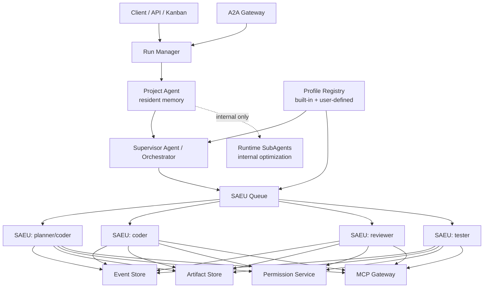

# 从单 Agent 执行单元到多 Agent 编排

> 结论：为了降低系统不确定性，平台第一版不做“轻量任务走 SubAgent、重量任务走 SAEU”的动态判断。平台调度对象统一是 `mission -> task -> profile -> SAEU run`。SubAgent 只作为某个 SAEU runtime 内部的可选实现细节，不作为第一版平台调度原语。

## 总体路线

```text
Phase 1: 单 SAEU 稳定
Phase 2: 多 SAEU 并发
Phase 3: Supervisor 拆分任务并创建 SAEU run
Phase 4: 子任务 artifact 合并
Phase 5: A2A Gateway 对外互操作
Phase 6: Temporal 或 durable workflow 接管长流程
```

关键原则：

- 先让一个执行单元可靠，再让多个执行单元并发。
- 平台 task 默认创建 SAEU run；SubAgent 只允许作为 SAEU 内部优化。
- 独立 SAEU 之间不共享可写 workspace。
- Agent 间通信优先通过 artifact 和事件，不直接互相读写不受控内存。
- Supervisor 负责规划、派发、合并、失败处理和人机协同。
- 外部协议可以是 A2A，内部执行器控制优先 ACP-compatible SAEU。

## 多 Agent 目标架构

这张图不是要否定“一个主 Agent 管多个不同角色 SubAgent”的形态。相反，OpenClaw 这类系统里的主 Agent / sub-agent / 独立 workspace / background task 已经很接近目标形态。但为了让开源项目和企业平台的语义稳定，第一版不把 SubAgent 暴露为平台调度对象。这里额外抽出 SAEU Queue 和 SAEU run，是为了确定一个统一边界：

- 如果一个主 Agent 能安全地 spawn sub-agent，且 sub-agent 有自己的 workspace、session、timeout 和结果回传，那么它已经可以承担很多多角色编排。
- 但平台层不判断某个 task 是否“足够轻量”。只要 task 进入 mission/task DAG，就创建 SAEU run。
- 如果某个 SAEU runtime 内部自己用 SubAgent 来完成探索、评审、总结，那是该 SAEU 的内部优化；平台只看 SAEU 的事件、权限、artifact 和终态。
- 所以图中的 SAEU 不是“比 SubAgent 更聪明的 Agent”，而是“被平台接管生命周期的 Agent run”。



更准确的实现关系是：

```text
Profile 是模板：planner / coder / reviewer / tester / doc-writer / custom...
Agent instance 是运行实体：第一版统一由某个 profile 启动为 SAEU run。
Supervisor 调度的是 task，不是直接调度“角色名”。
Run Manager 管理的是 SAEU run，不理解 agent 的内部思考过程。
SubAgent 不进入平台 task DAG，只作为 SAEU 内部实现细节。
```

## 编排对象

多 Agent 编排层只认识以下对象：

| 对象 | 含义 |
| --- | --- |
| `mission` | 用户的宏观目标 |
| `task` | 由 Supervisor 拆出的子任务，第一版统一映射为 SAEU run |
| `run` | 某个 SAEU 的一次执行 |
| `dependency` | 子任务之间的依赖 |
| `artifact` | 子任务输出 |
| `review` | 对 artifact 或 diff 的审查 |
| `decision` | Supervisor 或人类的决策 |
| `merge_plan` | 多个子任务结果的合并策略 |

不要把 Agent 之间的聊天记录当成唯一状态。生产系统的状态必须在 DB 中显式建模。

## Supervisor 职责

Supervisor 可以先是规则系统，后续再变成 Agent。它负责：

- 将 mission 拆成 tasks。
- 给每个 task 选择 agent profile。
- 为每个 task 解析 profile 并创建 SAEU run。
- 决定串行、并行或 fan-out/fan-in。
- 监听子 run 事件。
- 处理失败、超时、取消和权限升级。
- 收集 artifact。
- 触发 review/test。
- 生成最终报告或 merge plan。

Supervisor 不负责：

- 直接执行 shell。
- 直接修改所有子 workspace。
- 绕过 permission service。
- 直接读取 qwen serve 私有 session 状态。
- 直接调度 runtime 内部 SubAgent。

## Agent profile

Agent profile 应该是系统内置模板 + 用户可编辑模板，而不是硬编码角色枚举。第一版建议内置这些 profile：

| Profile | 工具权限 | 适用 |
| --- | --- | --- |
| `planner` | 只读文件、grep、web fetch、无写入 | 拆任务、读代码、设计方案 |
| `coder` | 读写 workspace、测试命令需审批 | 实现代码 |
| `reviewer` | 只读 diff、运行轻量检查 | 代码审查、风险识别 |
| `tester` | 运行测试、读写临时文件 | 验证和复现 |
| `doc-writer` | 文档目录写入 | 文档输出 |

每个 profile 映射到：

- tool allowlist。
- approval mode。
- model。
- max turns。
- timeout。
- workspace 策略。
- artifact 要求。

### Profile 与 Agent instance 的关系

Profile 不是 Agent instance。它更像“岗位说明书 + 权限模板 + 运行参数”：

| 概念 | 含义 | 例子 |
| --- | --- | --- |
| `profile` | 可复用模板 | `coder`、`reviewer`、`frontend-coder` |
| `agent instance` | 一次实际启动的 SAEU Agent | `coder-1`、`coder-2`、`reviewer-a` |
| `task assignment` | task 绑定到某个 profile 或 instance | `task_123 -> coder` |
| `run` | 平台治理的一次执行 | `run_abc` 使用 `coder` profile 启动 |

因此一个 profile 可以启动多个 Agent：

- 两个 `coder` SAEU 并行修不同模块。
- 多个 `reviewer` SAEU 并行审查不同 patch 或模块。
- 用户自定义 `security-reviewer` profile，限制为只读、允许 grep、允许运行静态扫描，但禁止写 workspace。

Profile 建议支持三层来源：

| 来源 | 是否可编辑 | 说明 |
| --- | --- | --- |
| system built-in | 否或只允许复制 | 平台内置安全默认值 |
| workspace/team profile | 是 | 团队共享的 profile |
| user profile | 是 | 用户个人自定义 |

Profile 草案：

```json
{
  "id": "coder",
  "display_name": "Coder",
  "description": "Implement code changes in an isolated workspace.",
  "runtime": {
    "preferred_adapter": "qwen",
    "fallback_adapters": ["codex", "claude", "opencode"],
    "model": "default"
  },
  "tools": {
    "allow": ["read_file", "write_file", "shell", "git_diff"],
    "deny": ["secrets_read", "deploy_prod"]
  },
  "approval": {
    "mode": "ask",
    "required_for": ["shell", "network", "git_push"]
  },
  "limits": {
    "max_turns": 40,
    "timeout_seconds": 3600,
    "max_parallel_instances": 3
  },
  "workspace": {
    "strategy": "git_worktree",
    "write_scope": "isolated_branch"
  },
  "artifacts": {
    "required": ["diff.patch", "implementation-notes.md"]
  }
}
```

在数据模型里，`tasks.profile` 只保存 profile id 和版本；实际执行时复制一份 resolved profile 到 run spec。这样用户后续修改 profile，不会改变历史 run 的审计含义。

### 与 OpenClaw 类主 Agent + SubAgent 的关系

如果一个 runtime 自身已经支持 sub-agent、独立 workspace 和 background task，那么可以把它视为“profile-aware runtime”。但平台第一版仍然只创建 SAEU run，不直接创建 runtime sub-agent。

| 场景 | 平台行为 |
| --- | --- |
| mission/task DAG 中出现一个 task | 创建 SAEU run |
| 需要多个角色并行 | 为同一或不同 profile 创建多个 SAEU run |
| SAEU runtime 内部使用 SubAgent | 平台不感知，只收 canonical events / artifacts |
| 需要 Kanban 中单独可见、可取消、可恢复 | 必须是 SAEU run |
| 需要跨机器、跨执行器、跨租户调度 | 必须是 SAEU run |
| 需要独立计费、审计、权限审批 | 必须是 SAEU run |

也就是说，OpenClaw 这类“主 Agent + sub-agent workspaces”可以作为某个 SAEU runtime 的内部实现。我们多出来的部分是平台层：Profile Registry、Run Manager、Event Store、Permission Service、Artifact Store、Queue 和对外 API。

后续如果确实要做成本优化，可以新增 `inline-capable` profile 标记，允许 Supervisor SAEU 内部用 SubAgent 完成某些 task。但这是 P4 之后的优化项，不是 MVP 默认行为；即使开启，也必须产出 task event、artifact 和 audit summary。

## Workspace 策略

多 Agent 最大风险之一是并发写冲突。建议：

| 场景 | 策略 |
| --- | --- |
| planner/reviewer | 共享只读 base workspace |
| coder 并行 | 每个 coder 一个独立 git worktree/branch |
| tester | 基于 coder artifact 创建临时 workspace |
| merge | 由 Supervisor 或 merge agent 独立执行 |

不要让多个 coder 同时写同一个目录。合并只通过 patch/artifact。

## 子任务通信

子 Agent 之间不直接聊天，默认通过 artifact 通信：

```text
planner -> plan.md
coder   -> diff.patch + implementation-notes.md
tester  -> test-report.md
reviewer-> review-findings.md
supervisor -> final-report.md
```

如果确实需要交互，走 Supervisor 中继：

```text
coder question -> supervisor decision -> reviewer/tester/coder input
```

这样所有跨 Agent 决策都有事件和审计。

## 失败处理

| 失败 | 处理 |
| --- | --- |
| 子 Agent 超时 | cancel run，保存 artifact，允许 retry |
| 权限超时 | deny/cancel，Supervisor 决定是否换策略 |
| coder 生成冲突 patch | reviewer/merge agent 处理，或重新分派 |
| tester 失败 | 把失败报告作为 coder follow-up input |
| reviewer 高风险 finding | 阻塞合并，进入人工审批 |
| Supervisor 崩溃 | 从 mission/task/run/event 表重建状态 |

每个子任务必须有终止原因：

- `succeeded`
- `failed`
- `cancelled`
- `timed_out`
- `blocked_permission`
- `blocked_conflict`
- `blocked_human`

## DAG 与专业编排工具

复杂任务会自然长成 DAG，但不要一开始就把所有 Agent 编排交给 Airflow 这类通用调度器。需要先区分三层 DAG：

| 层级 | 例子 | 第一选择 |
| --- | --- | --- |
| mission/task DAG | planner -> coder -> tester -> reviewer | 先用本系统 mission/task 表 + queue |
| durable execution DAG | 跨天任务、人工审批、失败恢复、worker crash resume | P5/P6 评估 Temporal 或 LangGraph |
| batch/business DAG | 每天批量跑 100 个 repo、定时生成报告、数据流水线 | 可接 Airflow |

Airflow 的强项是开发、调度和监控 batch-oriented workflows，DAG task 依赖和定时/事件触发非常成熟。它适合“外层批处理调度”，例如：

- 每晚对所有仓库创建一次 security review mission。
- 每周生成团队工程质量报告。
- 数据流水线完成后触发一批 Agent 分析任务。
- 把 100 个 repo 的任务分批投递到 Run Manager。

但 Airflow 不适合作为第一版 Agent runtime 核心，原因是：

- Agent run 是强交互、流式、可取消、带权限审批的长会话，不只是 batch task。
- Supervisor 生成的 DAG 可能在执行中动态变化，而 Airflow 更适合相对稳定、可声明的工作流结构。
- Agent 的核心审计要落在 Event Store / Permission Service / Artifact Store，而不是只看 Airflow task log。
- Airflow 可以触发 mission，但不应该直接控制 qwen/claude/codex 的 session、permission 和 workspace。

因此推荐路径是：

1. P3/P4 先实现内置轻量 DAG：`tasks`、`task_dependencies`、queue、retry、artifact handoff。
2. 当 mission 需要跨天、人工审批和可靠恢复时，评估 Temporal/LangGraph 作为 durable workflow 层。
3. 当需求是周期性批处理或企业已有 Airflow 平台时，把 Airflow 放在外层，用 Airflow task 调用本系统 API 创建/查询/cancel mission。

边界示例：

```text
Airflow DAG
  -> call Run Manager API: create mission
  -> poll/wait mission status
  -> collect artifact links

Run Manager / Supervisor
  -> task DAG
  -> SAEU run
  -> Event Store / Artifact Store / Permission Service
```

Airflow 是“调用我们系统的上游编排器”，不是“替代我们系统内部 Agent 控制面”的组件。

## A2A Gateway 位置

A2A 适合系统边界，而不是内部所有调用都必须 A2A。

```text
External A2A Client
  -> A2A Gateway
  -> mission/task/run
  -> SAEU
```

A2A Gateway 负责：

- 暴露 Agent Card。
- 把外部 task 映射为内部 mission/run。
- 把内部 run status 映射为 A2A task status。
- 把 artifacts 映射为 A2A artifacts。
- 把 internal streaming event 映射为 A2A streaming update。
- 把 push notification 映射为 webhook。

权限请求建议：

- 内部仍使用 Permission Service。
- A2A 侧可用 task state、message、metadata 或 extension 表达“需要用户输入/审批”。
- 不要假设所有 A2A 客户端都理解 coding-agent permission schema。

## 数据库表草案

```sql
create table missions (
  id text primary key,
  tenant_id text not null,
  created_by text not null,
  objective text not null,
  status text not null,
  created_at timestamptz not null default now(),
  updated_at timestamptz not null default now()
);

create table tasks (
  id text primary key,
  mission_id text not null references missions(id),
  parent_task_id text,
  profile text not null,
  objective text not null,
  status text not null,
  priority int not null default 0,
  created_at timestamptz not null default now()
);

create table task_dependencies (
  task_id text not null references tasks(id),
  depends_on_task_id text not null references tasks(id),
  primary key (task_id, depends_on_task_id)
);

create table runs (
  id text primary key,
  task_id text references tasks(id),
  unit_id text,
  status text not null,
  failure_kind text,
  started_at timestamptz,
  ended_at timestamptz
);
```

run events、permissions、artifacts 沿用单 Agent 事件模型。

## Phase 1：单 SAEU 稳定

目标：

- 一个 qwen serve 单元可以稳定执行任务。
- 支持审计、重放、恢复、权限、diagnostics。

验收：

- 单 run 生命周期完整。
- run 失败后能定位原因。
- 客户端断线可追事件。
- qwen daemon 崩溃可恢复或清晰失败。

## Phase 2：多 SAEU 并发

目标：

- 同一台 VPS 允许 1-2 个 SAEU 并发。
- 第二台 VPS 可作为 sandbox worker。

新增能力：

- worker capacity。
- run queue。
- lease/heartbeat。
- per-tenant quota。
- artifact 聚合页。

验收：

- 两个 run 并发不会污染 workspace。
- 一个 run 死掉不影响另一个。
- 资源超限会被限流而不是拖垮宿主机。

## Phase 3：Supervisor 拆分任务

目标：

- 从用户 mission 生成 tasks。
- tasks 可以串行或并行执行。

第一版可以用规则：

```text
if task_type == code_change:
  planner -> coder -> tester -> reviewer
if task_type == research:
  researcher -> reviewer -> doc-writer
```

后续再用 supervisor agent 生成 DAG，但 DAG 需要人工确认或策略约束。

验收：

- 子任务可以独立失败和重试。
- mission 状态可从 task/run 状态推导。
- final report 能引用每个子任务 artifact。

## Phase 4：合并与评审

目标：

- 多个 coder 的 patch 可以被审查和合并。

策略：

- 每个 coder 输出 patch。
- merge agent 在单独 workspace 应用 patch。
- tester 在 merge workspace 运行测试。
- reviewer 对最终 diff 做风险检查。
- 人类批准后才 push/merge。

验收：

- 冲突不会破坏 base workspace。
- 所有 merge 决策可审计。
- 测试失败能反馈给对应 coder。

## Phase 5：A2A Gateway

目标：

- 让外部系统以 A2A 调用本系统。
- 或让本系统调用外部 A2A agent。

实现：

- `/.well-known/agent-card.json` 或等效 Agent Card。
- `send task` -> `mission/run`。
- `task status` -> mission/task/run 状态聚合。
- `streaming` -> Event Store SSE bridge。
- `artifact` -> Artifact Store signed URL 或引用。
- `cancel` -> mission/run cancel。

验收：

- Gemini CLI remote subagent 能把本系统当远程 Agent 调用。
- 外部 task 能映射到内部 mission。
- 内部权限请求不会丢失，至少能反馈为“需要审批/用户输入”状态。

## Phase 6：Durable workflow

当 mission 可能跨天、多轮人工审批、多个 worker 节点时，优先评估 Temporal 或 LangGraph 这类更贴近 durable execution / agent workflow 的工具：

- `MissionWorkflow` 管 tasks DAG。
- `AgentRunWorkflow` 管单个 SAEU run。
- Activity 负责启动容器、投递 prompt、收集 artifact。
- 事件详情仍写 Event Store。

在此之前，Postgres queue + lease 足够。

Airflow 可作为外层 batch/workflow scheduler 引入，但不建议作为 Agent session 控制面。

## 最小可实施版本

第一版不要追求全自动多 Agent。建议最小范围：

1. 一个常驻 Project/Supervisor Agent 产出任务计划。
2. 人类确认计划。
3. planner/coder/tester/reviewer/doc-writer 都通过 profile 创建 SAEU run。
4. 一个 profile 可以创建多个 SAEU instance。
5. 每个 SAEU 内部可以自行使用 SubAgent，但平台不直接调度。
6. Supervisor 汇总 final report。

这已经具备多 Agent 的核心闭环，同时风险可控。

## 决策

多 Agent 编排的稳定性来自三个约束：

- 平台级 task 统一映射为 SAEU run，避免“轻重判断”带来的不确定性。
- SubAgent 只作为 SAEU 内部优化，不作为平台调度原语。
- SAEU 承担平台级治理边界，有独立状态、事件、权限、artifact、workspace。
- Agent 之间只通过 Supervisor 和 artifact 协作，不直接共享不受控状态。

这条路线比“多个 Agent 在一个大对话里互相聊天”更慢一点，也可能比纯 SubAgent 更重一点，但架构确定、可审计、可恢复、可逐步上线。
