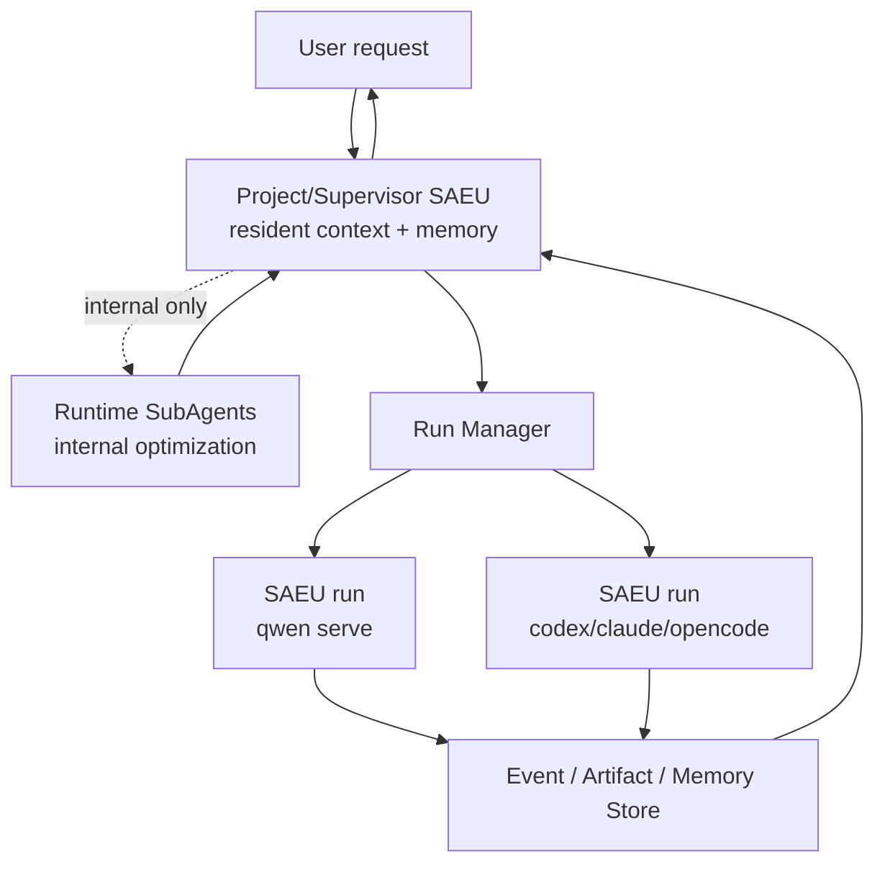

# SubAgent 与独立执行单元边界

> 结论：SubAgent 和 SAEU 不是竞争关系。SubAgent 是 Agent runtime 内部的协作机制；SAEU 是云端平台外部的治理、调度和审计边界。  
> 为了降低第一版系统复杂度，平台不做“轻量走 SubAgent、重量走 SAEU”的动态判断。MVP 中，平台 task 统一调度为 SAEU run；SubAgent 只作为某个 SAEU 内部的可选优化，不作为平台调度原语。

## 为什么这个问题重要

Qwen Code、Claude Code、Codex、OpenCode 这类 coding agent 本身已经支持 subagent、background task、worktree、session、permission、resume 等能力。直接把每个子任务都拆成独立进程或独立 daemon，可能会损失上下文连续性，并增加调度复杂度。

因此不能简单说“多 Agent = runtime 内部多个 SubAgent”。MVP 更准确的判断是：

```text
平台调度对象：SAEU run
角色与权限模板：Agent profile
Agent 内部优化：SubAgent
长期目标控制：Project/Supervisor SAEU
```

## SubAgent 的定位

SubAgent 更适合作为单个 SAEU 内部的实现细节：

- 一个 Qwen/Codex/Claude/OpenCode SAEU 内部并行搜索、阅读、review、总结。
- runtime 自己管理 sub-agent 的 context、workspace、权限和结果合并。
- 平台只记录该 SAEU 暴露出来的 canonical events、permissions、artifacts 和终态。
- SubAgent 不直接出现在 mission/task DAG 中。
- Run Manager 不直接启动、取消、恢复或计费某个 runtime sub-agent。

典型例子：

- coder SAEU 内部派生 SubAgent 阅读数据库模块。
- reviewer SAEU 内部派生多个 SubAgent 并行评审不同文件。
- tester SAEU 内部派生 SubAgent 分析测试失败原因。
- researcher SAEU 内部派生 SubAgent 查外部文档并返回摘要。

这些内部并行不改变平台调度模型：平台仍然只看到一个 SAEU run。

## 为什么平台默认 SAEU

平台默认 SAEU 的原因是确定性优先：

- 不需要判断“轻量/重量”。
- 每个 task 都有统一 run id、状态机、事件流、artifact 和权限链。
- 多客户端观察、取消、恢复、审计和计费都落在同一层。
- 多执行器接入更简单：Qwen/Codex/Claude/OpenCode 都实现 SAEU adapter。
- 一个 profile 可以启动多个 SAEU instance，实现确定的多角色并行。

典型例子：

- 为一个 GitHub issue 自动实现、测试、生成 PR。
- 跑一个 90 分钟的重构任务。
- 在不可信仓库中执行构建和测试。
- 多个用户同时观察同一个长任务。
- 一个任务需要在 worker 节点上隔离执行。

MVP 中即使是短任务，只要它是 mission/task DAG 的一部分，也按 SAEU run 管理。后续如果要降低成本，可以引入 `inline-capable` profile，让某些任务在 Supervisor SAEU 内部用 SubAgent 执行，但这必须是显式优化，不是默认策略。

## 常驻 Agent 的价值

用户提出的长期复杂需求，最好由一个常驻 Project/Supervisor Agent 承接。它负责：

- 维护项目记忆。
- 理解用户长期目标。
- 保存试错经验和上下文摘要。
- 拆分任务。
- 为每个 task 选择 profile 并创建 SAEU run。
- 汇总结果、产物和最终报告。

这可以避免每次启动独立执行单元都“失忆”。但 memory 不应只存在进程上下文里。关键事实必须沉淀到平台：

- thread summary。
- run events。
- artifacts。
- workspace snapshot。
- failure notes。
- permission history。
- project memory。

新的 SAEU run 启动时，由 Project/Supervisor Agent 或 Run Manager 显式注入这些上下文。

## 推荐调度策略



MVP 调度规则：

| 输入 | 平台行为 |
| --- | --- |
| mission 拆出 task | `task -> profile -> SAEU run` |
| 同一 profile 需要并行 | 创建多个 SAEU run |
| SAEU runtime 内部使用 SubAgent | 平台不直接感知 |
| 需要成本优化 | 后续通过显式 `inline-capable` profile 评估 |

## 对本项目的修正

之前文档里“每个子 Agent 都是 SAEU”的表述过强，容易导致过度拆分。更准确的设计是：

- 用户面对的是长期 Project/Supervisor SAEU。
- Supervisor 内部可以使用 runtime subagents，但这只是内部实现。
- 平台 task 默认都是 SAEU run，不做轻重判断。
- Qwen Code 路线中，一个 `qwen serve` daemon 可以承载常驻项目 Agent，也可以在 thread scope 中承载多条任务线。
- 多 workspace、多租户、高风险执行才启动多个 daemon 或多个 worker。

因此，目标系统不是“多个独立 Agent 进程并行跑”，而是：

> 一个长期目标控制面，统一调度 profile 驱动的 SAEU run；SubAgent 只作为 SAEU 内部实现细节。
